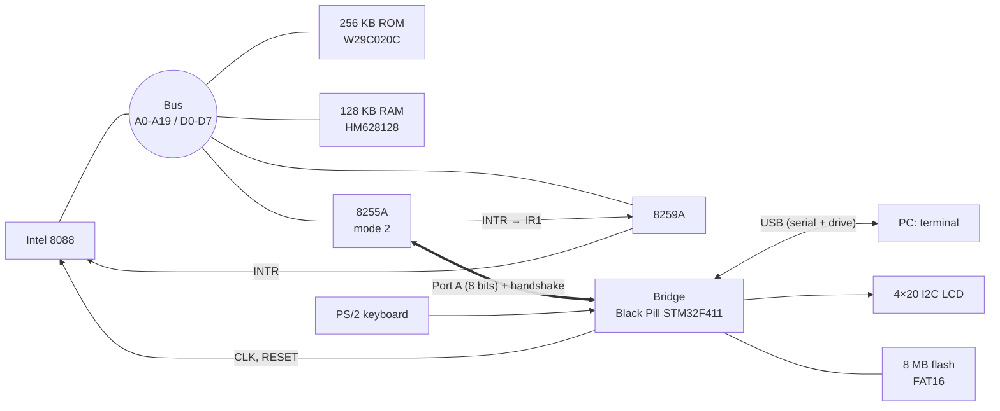
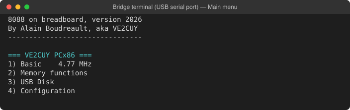
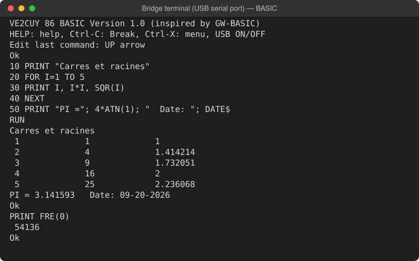
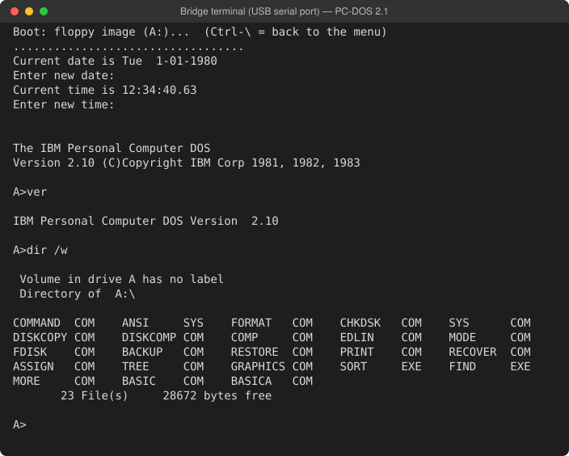
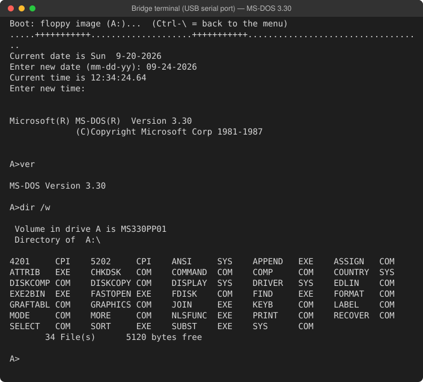

# breadboard-PC — an 8088 computer on a breadboard

A microcomputer with a PC/XT-inspired architecture, built on solderless breadboards around an
**Intel 8088**. Its ROM, whose source code is **written entirely in 8086 assembly language**, boots
into an interactive menu, runs two BASIC interpreters and **boots PC-DOS 2.1 and MS-DOS 3.30** from
floppy disk images.

A project by Alain Boudreault (VE2CUY), 2026. *[Version française](README_fr.md)*

<p align="center">
  <br>
  <em>The build: the Black Pill STM32F411 bridge (top centre), the 8088, the 8255, the 8259, the ROM and
  the RAM. The LCD shows the “Information” screen (date and time, versions, RAM, disk, speed).</em>
</p>

## At a glance

| | |
|---|---|
| **Processor** | Intel 8088, 4.77 MHz by default (adjustable from 1 to 10 MHz) |
| **Memory** | 256 KB ROM (W29C020C, `C0000h`–`FFFFFh`), 128 KB static RAM (HM628128, `00000h`–`1FFFFh`) |
| **I/O** | 8255A in mode 2 (bus to the bridge), 8259A (interrupts), 4×20 I2C LCD, PS/2 keyboard |
| **Bridge** | WeAct **Black Pill STM32F411** board: keyboard, USB terminal, LCD, clock, disk, RESET |
| **Software** | ROM written entirely in assembly (NASM, strict 8086 instruction set), both BASICs included: menu, BIOS for DOS, Tiny BASIC, GW-BASIC-style BASIC |
| **Operating systems** | PC-DOS 2.1 and MS-DOS 3.30, booted from a floppy disk image |

## The build

The core of the machine (processor, address latches, ROM, RAM, decoding) is wired on breadboards
with 74HC/74HCT logic and no programmable logic (no GAL, no CPLD). Address decoding takes only a few
NAND gates:

- **ROM**: `A19 = 1` (window `C0000h`–`FFFFFh`);
- **RAM**: `A19 = 0`;
- **8255** (ports `80h`–`83h`): `A7` and an I/O cycle;
- **8259** (ports `20h`–`21h`): `NAND(IO, A6, /A7)`.

<p align="center">
  <br>
  <em>Schematic of the core (KiCad). The clock, supplied here by an Arduino UNO R4, now comes from the bridge.</em>
</p>

## The circuit

The 8088 does not bit-bang any peripheral. All traffic goes through **a single 8255 in mode 2**: an
8-bit bidirectional bus with hardware handshaking, connected to the bridge. Every byte received from
the bridge raises an interrupt (`IR1` of the 8259).



The bridge wiring in detail (pins, 3.3 V / 5 V levels, pull-up resistors) is described (in French) in
[arduino/8088_bridge_stm32/README.md](arduino/8088_bridge_stm32/README.md).

## The STM32 bridge

The bridge firmware (a PlatformIO project, [arduino/8088_bridge_stm32](arduino/8088_bridge_stm32))
gives the 8088 the peripherals of a PC:

| Function | Details |
|---|---|
| **PS/2 keyboard** | Frame decoding; raw scan codes passed to the 8088 |
| **Terminal** | Native USB serial port to the PC (ANSI, 80 columns) |
| **Display** | 4×20 HD44780 LCD over I2C (PCF8574) |
| **Real-time clock** | STM32 RTC (32.768 kHz crystal): `TIME$`, `DATE$`, `INT 1Ah` |
| **Disk** | 8 MB W25Q64 SPI flash formatted FAT16: files, sectors, floppy images mounted as A: |
| **USB drive** | The flash is exposed to the PC as a USB drive (`USB ON` / `USB OFF`) to copy files onto it |
| **8088 clock** | `CLK` signal generated by hardware PWM, 1 to 10 MHz |
| **8088 RESET** | Held while the bridge starts up; **Ctrl-Alt-Del** (PS/2) or **Ctrl-\\** (terminal) |

The 8088 talks to the bridge through a command protocol on a dedicated channel
(see [Solution-01/lib/bridge.asm](Solution-01/lib/bridge.asm)).

## The menu

At power-up, the ROM displays a menu on both the terminal and the LCD. It can be driven from either
the PS/2 keyboard or the terminal; **Esc** returns to the main menu.

<p align="center">
  
</p>

| Menu | Options |
|---|---|
| **1) Basic** | Tiny BASIC; GW-BASIC-style BASIC |
| **2) Memory functions** | Memory dump and editing, CPU registers, code entry and execution, interrupt vector table, RAM test |
| **3) USB Disk** | USB drive toggle, file list, **booting a disk image** |
| **4) Configuration** | Clock speed, CPU speed test, date and time setting, information screen |

## BASIC

An original reimplementation inspired by GW-BASIC: same keywords, same error messages, integers,
single-precision floating point (in software) and strings. About 54 KB are free for programs.

<p align="center">
  
</p>

| Category | Commands and functions |
|---|---|
| **Program** | `RUN` `LIST` `EDIT` `DELETE` `NEW` `CLEAR` `CONT` `TRON` `TROFF` `HELP` `SYSTEM` |
| **Control flow** | `IF…THEN…ELSE` `GOTO` `GOSUB`/`RETURN` `ON…GOTO/GOSUB` `FOR…NEXT` `WHILE…WEND` `END` `STOP` |
| **Data** | `LET` `DIM` `ERASE` `SWAP` `DATA`/`READ`/`RESTORE` `DEF FN` `DEFINT`/`DEFSNG`/`DEFSTR` |
| **Input/output** | `PRINT` `INPUT` `LINE INPUT` `INKEY$` `CLS` `LOCATE` `COLOR` `BEEP` |
| **Math** | `ABS` `SGN` `INT` `FIX` `SQR` `SIN` `COS` `TAN` `ATN` `LOG` `EXP` `RND` `RANDOMIZE` |
| **Strings** | `LEN` `LEFT$` `RIGHT$` `MID$` `INSTR` `CHR$` `ASC` `STR$` `VAL` `HEX$` `UCASE$` `STRING$` |
| **Files** | `SAVE` `LOAD` `MERGE` `FILES` `KILL` `FORMAT`; `OPEN` `PRINT #` `INPUT #` `EOF` `CLOSE` |
| **Clock** | `TIMER` `TIME$` `DATE$` (read and set the bridge RTC) |
| **Machine** | `PEEK` `POKE` `DEF SEG` `INP` `OUT` `WAIT` `CALL` `FRE` |
| **Disk and system** | `DSKREAD` `DSKWRITE` `USB ON`/`OFF` `BOOT "image.img"` |

## DOS 2.1 and DOS 3.3

The ROM provides the BIOS layer a DOS expects: disk (`INT 13h`, CHS and LBA), keyboard (`INT 16h`),
clock (`INT 1Ah`), text output to the terminal (`INT 10h`) and bootstrap (`INT 19h`). A floppy image
copied to the flash (through the USB drive) is mounted as drive **A:** and booted from
**USB Disk → 3) Boot disk image**, or with `BOOT "PCDOS2_1.IMG"` from BASIC. DOS writes go to the
image file.

<p align="center">
  <br>
  <em>PC-DOS 2.1: booting from the image (one dot per sector read), VER, DIR /W</em>
</p>

<p align="center">
  <br>
  <em>MS-DOS 3.30</em>
</p>

Limitations: 128 KB of RAM (DOS 5.0 and later require 256 KB), no video hardware (programs that write
to video memory display nothing), DOS keyboard input from the terminal only.

## Building the ROM

```sh
cd Solution-01
make            # solution-01.bin (256 KB, to be burned into the W29C020C); make rom-en for English
make check      # checks size, reset vector and signature
make test       # test benches under emulation (Unicorn)
make test-rom   # full ROM simulation: DOS, BASIC, PS/2 keyboard
```

Tools: NASM, GNU Make, Python 3 (+ `unicorn` for the tests); PlatformIO for the bridge
(`platformio run -e blackpill_f411ce_usbdrive -t upload`, board in DFU mode).

## Repository layout

| Folder | Contents |
|---|---|
| [Solution-01/](Solution-01) | 8088 ROM (NASM) and tests; full technical documentation (in French) in [Solution-01/README.md](Solution-01/README.md) |
| [arduino/8088_bridge_stm32/](arduino/8088_bridge_stm32) | Firmware of the Black Pill STM32F411 bridge (PlatformIO) |
| [kicad/](kicad) | Schematics of the build |
| [PC-DOS/](PC-DOS) | Test floppy disk images |
| [medias/](medias) | Datasheets, schematics and screenshots |

> The terminal screenshots on this page are produced by the actual (English) ROM, running in the
> project's simulator ([medias/captures/generer.py](medias/captures/generer.py)).
