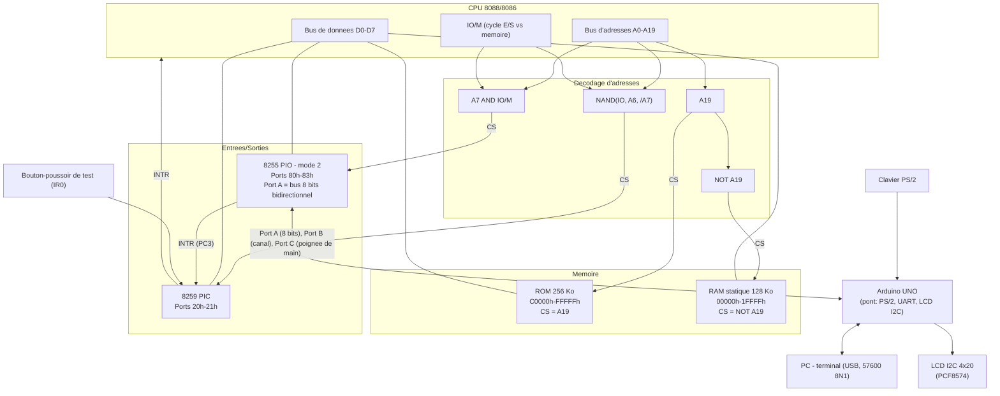

# Solution-01 — 8088/8086 sur breadboard (VE2CUY)

Firmware ROM pour un ordinateur 8088/8086 assemblé sur breadboard par
Alain Boudreault (VE2CUY). Au démarrage, la carte :

1. affiche un écran de démarrage sur le LCD I2C 4×20 pendant 1 seconde ;
2. affiche un **menu interactif** (UART + LCD I2C), piloté au **clavier
   PS/2 ou au terminal UART du PC** (les deux sont équivalents), qui
   reste le comportement normal de la carte tant qu'elle est sous
   tension — voir [Menu interactif](#menu-interactif) ci-dessous pour
   la structure complète.

**Architecture « Arduino »** : le 8088 ne pilote plus aucun périphérique
en bit-bang. Un **Arduino UNO** décode le clavier PS/2, possède l'UART
matériel (vers le PC, par l'USB) et le bus I2C du LCD ; le 8088 ne lui
parle que par **un 8255 en mode 2** (un seul bus de 8 bits
bidirectionnel avec poignée de main matérielle) et reçoit ses octets par
une **interruption matérielle** du 8259 — voir
[Pont Arduino](#pont-arduino-8255-en-mode-2). Le croquis de l'Arduino est
dans `../arduino/ve2cuy_bridge/` (dépôt Git, à côté de `Solution-01/`).

⚠️ Le pilote du LCD **parallèle** (`lib/lcd.asm`) reste dans le dépôt
(historique) mais plus aucun code du firmware ne l'appelle : il écrirait
sur le Port A, qui est maintenant le bus du pont Arduino.

Contrairement aux versions précédentes, il n'y a plus de « power-on
self-test » (POST) qui s'enchaîne automatiquement — chaque test (RAM,
dump ROM/RAM, édition de la RAM, registres, IVT, Tiny BASIC, BASIC) est déclenché
explicitement depuis le menu. Un clavier (PS/2 **ou** terminal UART) est
donc **requis** pour que la carte fasse quoi que ce soit après le
splash.

## Matériel visé

- CPU 8088/8086 (le code est écrit pour être compatible 8086 strict —
  voir `CPU 8086` dans `solution-01.asm` — mais ciblé pour tourner sur
  un vrai 8088)
- ROM 256 Ko, mappée à l'adresse physique `C0000h-FFFFFh`
- RAM statique 128 Ko
- Un **8259A** (contrôleur d'interruptions) : ports `20h`/`21h` (comme le
  PC/XT), `CS#` décodé par une porte NAND sur `IO`, `A6` et `/A7`. `IR0` =
  bouton-poussoir de test, `IR1` = `INTR` du 8255 (octet reçu de
  l'Arduino). Détails : [Interruptions matérielles](#interruptions-matérielles-8259)
- Un **8255** (PIO, ports `80h-83h`) en **mode 2** — voir
  [Pont Arduino](#pont-arduino-8255-en-mode-2)
- Un **Arduino UNO** (`arduino:avr:uno`) qui porte les périphériques :
  - clavier PS/2 (`CLK`/`DATA` sur l'Arduino, **pas** sur le 8255) ;
  - UART vers le PC = le port série USB de l'UNO (**57600 8N1** par
    défaut, réglable, voir `UART_BAUD` dans le croquis) ;
  - LCD I2C HD44780 4×20 (expandeur PCF8574, adresse `0x27`, ou `0x3F`
    pour un PCF8574A) sur `A4`/`A5`.
- **Câblage Arduino ↔ 8255/8259** (18 broches, aucun circuit intégré
  supplémentaire) :

| Arduino | Signal | Côté 8088 |
|---|---|---|
| `D10` `D11` `D12` `D13` | bus de données | `PA0` `PA1` `PA2` `PA3` |
| `A3` `A2` `A1` `A0` | bus de données | `PA4` `PA5` `PA6` `PA7` (ordre selon le câblage réel du montage — voir `BUS[]` dans le croquis) |
| `D4` | `ACK#` (sortie Arduino) | `PC6` |
| `D5` | `STB#` (sortie Arduino) | `PC4` |
| `D6` | `OBF#` (entrée Arduino) | `PC7` |
| `D7` | étiquette de l'octet envoyé au 8088 | `PC0` (entrée du 8255) |
| `D8` `D9` | canal de l'octet reçu du 8088 | `PB0` `PB1` |
| `D2` `D3` | `CLK` / `DATA` du clavier PS/2 | — |
| `A4` `A5` | `SDA` / `SCL` du LCD I2C | — |
| — | `INTR` du 8255 | `PC3` → `IR1` du 8259 |

  `D0`/`D1` sont réservées à l'USB. Résistances de tirage conseillées :
  10 kΩ vers +5 V sur `STB#`/`ACK#` (flottantes pendant le démarrage de
  l'Arduino), 4,7 kΩ vers +5 V sur `CLK`/`DATA` du PS/2 (et éloigner ces
  fils de `D0`/`D1`/`D4`/`D5`/`A4`/`A5`, dont la diaphonie perturbe les
  trames — voir Directives.md).

> **Câblage USB → PS/2** (pour un clavier/câble USB adapté en PS/2) :
> `VBUS`→`+5V`, `D−`→`Data`, `D+`→`Clock`, `GND`→`GND`. Fonctionne avec
> tout clavier USB à repli PS/2 (confirmé sur ce montage) — pas avec
> un clavier USB « pur » sans ce repli.

## Schéma bloc du circuit électronique

Décodage d'adresses (logique simple, sans décodeur dédié — un seul
bit d'adresse suffit à distinguer ROM/RAM, la sélection des circuits
d'E/S se faisant sur le bus d'E/S) :

- **ROM** : `CS = A19`
- **RAM** : `CS = NOT A19`
- **8255 (PIO)** : `CS = A7 AND IO/M` (cycle d'E/S, adresse ≥ 80h —
  `A0`/`A1` vont directement aux broches `A0`/`A1` du 8255 pour
  sélectionner Port A/B/C/registre de commande — voir `PORTA`/`PORTB`/
  `PORTC`/`PIO` dans `include/hardware.inc`, ports 80h-83h)
- **8259 (PIC)** : `CS#` par NAND(`IO`, `A6`, `/A7`) — ports `20h`/`21h`



⚠️ Note : la sélection de la ROM ne dépend que de `A19` (pas de
`A18`) — la ROM physique (256 Ko = `A0-A17`) est donc mise en miroir
sur les 512 Ko de la moitié haute de l'espace mémoire (`80000h-FFFFFh`)
si `A18` n'est câblé nulle part ailleurs ; le firmware n'utilise que
la fenêtre `C0000h-FFFFFh`. Même remarque pour la RAM (128 Ko, moitié
basse de 1 Mo) : seuls `00000h-1FFFFh` sont réellement testés par
`test_ram` (voir `solution-01.asm`).

## Pont Arduino (8255 en mode 2)

Le 8255 est programmé par `init_8255` avec le mot de mode `C1h`
(`MASQUE_PIO`, `include/hardware.inc`) : **Port A en mode 2**, Port B en
sortie (mode 0), `PC0`-`PC2` en entrée. Le mode 2 fournit un bus de 8 bits
**bidirectionnel** avec une poignée de main matérielle sur le Port C, et
le 8255 ne pilote le bus **que pendant `ACK#` bas** — aucun conflit
possible avec l'Arduino.

| Signal | Rôle |
|---|---|
| Port A (`PA0-PA7`) | bus de données, dans les deux sens |
| Port B (`PB0`/`PB1`) | **canal** de l'octet que le 8088 envoie : `0` = octet UART (`PB_CHAN_UART`), `1` = commande LCD (`PB_CHAN_LCD_CMD`), `2` = donnée LCD (`PB_CHAN_LCD_DATA`), `3` = **commande pour le pont** (`PB_CHAN_CMD`, horloge RTC : voir `lib/bridge.asm`) |
| `PC7` `OBF#` | 8088 → Arduino : `0` = un octet attend (le 8255 le repasse à `1` dès que l'Arduino abaisse `ACK#`) |
| `PC6` `ACK#` | Arduino → 8255 : l'Arduino le pulse pour lire l'octet |
| `PC4` `STB#` | Arduino → 8255 : impulsion qui verrouille l'octet à destination du 8088 |
| `PC5` `IBF` | octet reçu de l'Arduino pas encore lu |
| `PC3` `INTR` | câblée sur `IR1` du 8259 (`INTE2` actif, `INTE1` inactif) |
| `PC0` | étiquette posée par l'Arduino : `0` = scan code clavier, `1` = octet UART reçu |
| `PC1` | étiquette (pont STM32) : `1` = l'octet est une **réponse** à une commande du canal 3 (prioritaire sur `PC0`). `PC1` doit être reliée à la sortie `TAG1` du pont et **tirée à 0 par 10 kΩ**. Elle n'est lue que **pendant une commande** (`BRIDGE_EXPECT_OFF`) : non câblée, elle ne perturbe pas le clavier ni l'UART, mais un octet tapé pendant la lecture de l'heure (~ 10 ms) risque d'être pris pour une réponse |

**8088 → Arduino** (`arduino_send`, `lib/common.asm`) : pose le canal sur
le Port B puis écrit l'octet sur le Port A (les deux `OUT` sous
`pushf`/`cli`/`popf`). **Contrôle de flux** : elle attend d'abord `OBF#`
à `1`. Pour ne jamais bloquer le boot sans Arduino : `ARD_UNKNOWN` (rien
consommé depuis le reset) attend jusqu'à ~3 s (l'UNO met 1-2 s à
démarrer), `ARD_ALIVE` ~0,5 s puis passe à `ARD_ABSENT`, qui n'attend
plus (l'octet est perdu) jusqu'à revoir `OBF#` à `1`. Tous les affichages
(UART et LCD) passent par cette seule routine ; l'ordre est conservé
(une seule file côté Arduino).

**Commandes du pont (canal 3, `lib/bridge.asm`)** — pont STM32 seulement : le 8088
envoie sur le canal 3 un octet d'opération puis ses arguments ; le pont répond par
des octets étiquetés `PC1 = 1`, que `irq1_arduino_handler` range dans un tampon
circulaire (`BRIDGE_RX_*`, `bridge_rx_get` avec délai). `00h` PING (réponse `B1h`,
version, capacités), `01h` LIRE l'heure (8 octets : année sur 2 octets, mois, jour,
heures, minutes, secondes, centièmes), `02h` + 7 octets RÉGLER l'heure. Un pont sans
RTC (UNO) ne répond pas : `rtc_get` rend `CF = 1` (`Device Timeout` en BASIC). Le **disque** utilise les codes `10h`-`19h` (statut, formater, ouvrir, lire 1-32 octets, écrire 1-32 octets, fermer, répertoire début/suivant, supprimer, espace libre ; les routines `fs_*` de `lib/bridge.asm`) ; le tampon des réponses (`BRIDGE_RX_*`) fait 64 octets.

**Arduino → 8088** : l'Arduino pose l'étiquette (`PC0`) et l'octet, puis
pulse `STB#`. `INTR` déclenche `irq1_arduino_handler` (`INT 09h`) : elle
lit le Port C (`IBF` confirme qu'un octet est là, `PC0` donne l'origine),
lit le Port A (ce qui acquitte le 8255) puis enfile l'octet dans le
tampon circulaire du clavier (`ps2_rx_push`) ou de l'UART
(`uart_rx_push`), envoie l'EOI et fait `IRET`. Une lecture de `PORTA`
juste avant le `sti` de `start:` vide un éventuel octet arrivé avant
l'initialisation du 8259 (`INTR` reste haute tant que le Port A n'est pas
lu et le 8259 est déclenché par front).

**Côté Arduino** (`../arduino/ve2cuy_bridge/ve2cuy_bridge.ino`) :

- **8255 → périphériques** : file de 255 entrées ; UART → `Serial`, LCD →
  bibliothèque maison sur `Wire` (init 4 bits complète au démarrage, une
  transaction I2C de 4 octets par octet HD44780, attente 2 ms pour
  Clear/Home). Chaque commande `28h` (Function Set, début de
  `i2c_lcd_init` côté 8088) rejoue l'initialisation « par instruction »
  (`lcdResync`) pour récupérer un LCD déréglé.
- **Lecture du bus** : `OBF#` repasse à `1` dès que `ACK#` *descend*, et le
  8088 peut alors écrire l'octet suivant : le croquis prend donc un
  **instantané** de `PINB`/`PINC`/`PIND` (< 1 µs) — canal et octet — puis
  relâche `ACK#`.
- **Clavier PS/2** : interruption `INT0` sur chaque front descendant de
  `CLK`. Filtre anti-parasite (`CLK` doit rester basse `PS2_GLITCH_US` =
  10 µs), `DATA` par vote majoritaire de 3 lectures, resynchronisation
  après `PS2_FRAME_GAP_US` = 250 µs sans front, contrôle start/parité
  impaire/stop.
- **Aucun accès au bus pendant une trame PS/2** : l'Arduino n'envoie un
  octet clavier qu'après `KBD_QUIET_US` = 3 ms sans front `CLK` (fin de la
  rafale `F0` + code) et n'acquitte/n'envoie le reste qu'après
  `BUS_QUIET_US` = 0,4 ms. Sans cela, les impulsions `STB#`/`ACK#`
  perturbaient la trame suivante (touche perdue, la suivante avalée).
- `GAP_US` = 1 ms d'espace minimal entre deux octets Arduino → 8088 (pas de
  broche libre pour lire `IBF`).

Réglages en tête du croquis :

| Constante | Défaut | Rôle |
|---|---|---|
| `UART_BAUD` | 57600 | débit 8N1 vers le PC (validé sur le matériel) |
| `LCD_ADDR` | `0x27` | adresse I2C du PCF8574 (`0x3F` pour un PCF8574A) |
| `GAP_US` | 1000 | espace minimal entre deux octets Arduino → 8088 |
| `KBD_QUIET_US` / `BUS_QUIET_US` | 3000 / 400 | silence `CLK` avant d'agir sur le bus |
| `DEBUG_PS2` | 0 | `1` = trace PS/2 sur le terminal (voir ci-dessous) |

**Trace `DEBUG_PS2=1`** (entrelacée avec la sortie du 8088, à n'utiliser
que pour diagnostiquer) : `{76}` octet décodé, `{>76}` octet envoyé au
8088, `{P76}`/`{S76}` erreur de parité/de stop, `{G}` start parasite,
`{Rn}` resynchronisation à `n` bits, `{O}` file PS/2 pleine, `{g}`
parasite filtré.

**Variante STM32** : le pont a été **porté** sur une WeAct Black Pill V3.1
(STM32F411, USB natif, 100 MHz) dans `../arduino/8088_bridge_stm32/` (projet PlatformIO) — même
protocole côté 8088 (aucun changement du firmware), câblage et vérifications
dans le `README.md` de ce dossier. **Validé sur le matériel** (clavier PS/2,
terminal USB, LCD, menu et BASIC).

**Compilation** (`arduino-cli`, installé sous WSL avec le cœur
`arduino:avr`) :

```sh
arduino-cli compile --fqbn arduino:avr:uno breadboard/arduino/ve2cuy_bridge
```

Ouvrir le moniteur série réinitialise l'UNO (DTR) : la sortie du 8088
est perdue ~2 s pendant ce redémarrage. Le terminal doit interpréter
l'ANSI (PuTTY, Tera Term, minicom…), faire au moins 24 lignes × 80
colonnes, avoir l'**écho local désactivé** (c'est le 8088 qui fait
l'écho) et envoyer Entrée en `CR`.

## Interruptions matérielles (8259)

`init_8259` programme le 8259A en mode PC/XT : déclenchement par
**front**, 8259 unique (pas d'`ICW3`), mode 8086, **EOI manuel**, vecteurs
`IR0`-`IR7` → `INT 08h`-`0Fh`. Masque `OCW1` = `11111100b` : seules `IR0` et
`IR1` sont démasquées (les autres lignes, non câblées, resteraient
flottantes).

| Ligne | Vecteur | Gestionnaire | Rôle |
|---|---|---|---|
| `IR0` | `INT 08h` | `irq0_test_handler` | bouton-poussoir de test : affiche un message sur l'UART |
| `IR1` | `INT 09h` | `irq1_arduino_handler` | `INTR` du 8255 : scan code clavier **ou** octet UART reçu (voir [Pont Arduino](#pont-arduino-8255-en-mode-2)) |

`IR4` (UART, convention PC/XT) n'est **pas** utilisée : il n'y avait plus
de broche libre sur l'Arduino, l'UART reçu passe donc lui aussi par `IR1`.
La réception est pilotée par interruption ; la **lecture** ne l'est pas :
`ps2_get_char` scrute les deux tampons circulaires (16 octets pour le clavier PS/2, 256 pour l'UART).

Deux règles à respecter pour que le clavier ne perde pas d'octets :
l'instruction `INT` met `IF` à 0, donc `int10h_handler` et
`int16h_handler` font un `sti` dès leur entrée (le 8255 ne retient qu'un
octet reçu, un affichage peut attendre `OBF#` ~1 ms) ; et tout `cli` doit
être suivi d'un `popf`/`sti` (`test_ram` restaure `IF` par `pushf`/`popf`).

## Structure du dossier

```
i86/                            (racine du dépôt Git)
├── medias/                     Datasheets (8259A, ATmega328P) et schémas
└── breadboard/
    ├── arduino/
    │   ├── ve2cuy_bridge/      Croquis du pont Arduino (PS/2, UART, LCD I2C)
    │   ├── 8088_bridge_stm32/  Portage du pont sur WeAct Black Pill V3.1 (STM32F411), PlatformIO — validé
    │   └── irq_test/           Ancien test de branchement IR1/IR4 (obsolète)
    └── Solution-01/
        ├── solution-01.asm     Flux principal (start, menus, éditeur RAM,
        │                        registres, IVT, gestionnaires INT/IRQ) +
        │                        tous les textes/données
        ├── Directives.md       Cahier des charges et journal du projet
        ├── Makefile            Automatise l'assemblage (voir Makefile.md)
        ├── Makefile.md         Explication détaillée du Makefile
        ├── tests/              Bancs d'essai sous émulateur (Unicorn)
        │   ├── tb_test.asm     Tiny BASIC : harnais assemblé avec lib/tiny_basic.asm
        │   ├── tb_test.py      (sorties BASIC, retour au menu, écritures)
        │   ├── fl_test.asm/.py Bibliothèque flottante (comparée à numpy.float32)
        │   ├── basic_test.asm  BASIC : harnais assemblé avec lib/basic.asm
        │   ├── basic_harness.py  émulateur, E/S UART simulées, garde d'écritures
        │   └── basic_test.py   scénarios du BASIC (make test)
        ├── check_rom.py        Validation structurelle du .bin assemblé
        ├── .gitignore          Ignore build/ (fichiers jetables de check-modules)
        ├── include/
        │   ├── hardware.inc    Constantes matérielles (8255 mode 2, 8259,
        │   │                   adresses RAM des variables partagées)
        │   ├── delay.inc       Macro `delay_ms` (voir lib/utils.asm)
        │   └── lcd_macros.inc  Macros `lcd_goto`/`lcd_show`/`i2c_lcd_goto`/
        │                       `i2c_lcd_show` + `gotoxy`/`print` (INT 10h -
        │                       voir plus bas)
        └── lib/
            ├── common.asm      `arduino_send` (8088 → Arduino, contrôle de
            │                   flux OBF#), `porta_write` (historique, LCD
            │                   parallèle) + hex_table
            ├── lcd.asm         Pilote du LCD parallèle (historique, inutilisé)
            ├── uart.asm        UART via l'Arduino (TX, RX, décimal, ANSI)
            ├── utils.asm       delay_ms_proc (routine derrière la macro)
            ├── lcd_i2c.asm     LCD I2C via l'Arduino (commande/donnée HD44780)
            ├── ps2.asm         Clavier PS/2 + terminal UART : ps2_get_char
            ├── tiny_basic.asm  Interpréteur Tiny BASIC (sous-menu Basic, option 1)
            ├── basic.asm       BASIC « GW-BASIC-like » (sous-menu Basic, option 2) : cœur, tokeniseur ;
            │   basic_tokens.inc, basic_float.asm, basic_fmath.asm, basic_eval.asm,
            │   basic_str.asm, basic_stmt.asm, basic_func.asm, basic_data.asm
            └── bin/            (généré) lcd.bin, uart.bin, lcd_i2c.bin, ps2.bin
```

Fichiers générés par `make` (non versionnés, voir `.gitignore`) :
`solution-01.bin`, `lib/bin/lcd.bin`, `lib/bin/uart.bin`,
`lib/utils.bin`, `lib/bin/lcd_i2c.bin`, `lib/bin/ps2.bin`, `lib/bin/tiny_basic.bin`,
`lib/bin/basic.bin`, `build/check/*.bin`, `build/*_test*.bin`.

**Règle importante** : tous les `%include` du projet sont écrits comme
des chemins relatifs à la racine `Solution-01/`, jamais
relatifs au fichier qui fait le `%include` — NASM résout les chemins
par rapport au répertoire courant au moment de l'assemblage. Il faut
donc toujours lancer `nasm`/`make` **depuis ce dossier**, jamais depuis
un sous-dossier.

## Fonctions d'accès au LCD parallèle (`lib/lcd.asm`) — historique

⚠️ **Plus utilisé** : aucun code du firmware n'écrit sur le LCD parallèle
(tout l'affichage passe par le LCD I2C, via l'Arduino). Le fichier reste
dans le dépôt ; il écrit sur le Port A via `porta_write`, donc **ne pas
l'appeler** : le Port A est maintenant le bus du pont Arduino. Ses délais
(`lcd_delay`…) ne servent plus non plus à `lib/lcd_i2c.asm`.

| Fonction | Rôle |
|---|---|
| `lcd_init` / `lcd_command` / `lcd_data` / `lcd_strobe` / `lcd_print` | Pilote HD44780 4 bits (historique) |
| `lcd_tx_hex_nibble` / `lcd_tx_hex_byte` / `lcd_tx_hex_word` / `lcd_tx_dec3` | Affichage hexadécimal/décimal (historique) |
| `lcd_short_delai` / `lcd_delay` / `lcd_delay_long` / `lcd_powerup_delay` | Délais HD44780 (historique) |

## Fonctions d'accès à l'UART (`lib/uart.asm`)

UART « relayé » par l'Arduino : l'UART **matériel** de l'Arduino (USB, vers
le PC) gère le cadencement — aucune temporisation liée au débit ni à
l'horloge du 8088.

| Fonction | Rôle |
|---|---|
| `uart_tx_string` | Transmet une chaîne terminée par `0` depuis `DS:SI` |
| `uart_tx_byte` | Envoie `AL` à l'Arduino sur le canal `PB_CHAN_UART` (`arduino_send` : contrôle de flux `OBF#`). **Préserve tous les registres** |
| `uart_tx_hex_nibble` / `uart_tx_hex_byte` / `uart_tx_hex_word` | Affiche une valeur en hexadécimal majuscule (entrée : `AL` ou `AX`) — générées par `def_tx_hex_nibble`/`byte`/`word` |
| `uart_tx_bin_word` | Affiche `AX` en binaire (16 caractères) |
| `uart_tx_dec8` | Affiche `AL` en décimal, sans zéros de tête |
| `uart_ansi_goto` | Positionne le curseur du terminal (`ESC [ ligne ; colonne H`), `DH` = ligne, `DL` = colonne (1-based) |
| `uart_rx_push` | Appelée par `irq1_arduino_handler` : enfile un octet UART reçu (tampon circulaire de 256 octets, `0FD00h`) |
| `uart_rx_available` | `CF`=0 si un octet UART attend, non bloquante |
| `uart_rx_byte` | Retire un octet du tampon (bloque tant qu'il est vide), préserve `BP` |

## Fonctions d'accès au LCD I2C (`lib/lcd_i2c.asm`)

LCD HD44780 4×20 derrière un PCF8574. Le 8088 **ne parle plus I2C** : il
envoie à l'Arduino des octets HD44780 complets (même encodage standard
qu'avant : `01h` = clear, `28h` = function set, `80h+adresse` = curseur…),
sur le canal `PB_CHAN_LCD_CMD` (RS=0) ou `PB_CHAN_LCD_DATA` (RS=1). L'Arduino
possède la séquence de démarrage 4 bits, le découpage en quartets, le
protocole I2C et les délais d'exécution du contrôleur : **le 8088 n'a plus
aucun délai à respecter** — le contrôle de flux `OBF#` l'arrête si
l'Arduino prend du retard. Résultat : un octet LCD = 3 écritures de port
au lieu d'une transaction I2C bit-bang de plusieurs centaines de µs.

| Fonction | Rôle |
|---|---|
| `i2c_lcd_init` | Envoie Function Set / Display ON / Entry Mode / Clear (l'Arduino resynchronise le LCD sur le Function Set) |
| `i2c_lcd_command` / `i2c_lcd_data` | Envoie un octet complet (entrée : `AL`) — RS=0 / RS=1 |
| `i2c_lcd_send_byte` | Choisit le canal selon `BL` (bit 0 = RS) et appelle `arduino_send` |
| `i2c_lcd_print` | Affiche une chaîne terminée par `0` depuis `DS:SI` |
| `i2c_lcd_tx_hex_nibble` / `i2c_lcd_tx_hex_byte` / `i2c_lcd_tx_hex_word` | Affiche une valeur en hexadécimal majuscule (entrée : `AL`/`AX`) — générées par `def_tx_hex_*` |
| `i2c_lcd_tx_dec3` | Affiche `AX` (0-999) en décimal, toujours sur 3 chiffres |

Positionnement DDRAM : voir les macros `i2c_lcd_goto`/`i2c_lcd_show`
ci-dessous. Toutes ces routines préservent leurs registres (comme
`uart_tx_byte`).

## Macros de refactoring

Plusieurs familles de procédures quasi identiques (LCD parallèle, LCD
I2C, UART) ont été remplacées par des macros NASM — même comportement,
code source bien plus compact. Aucun changement fonctionnel : les
octets assemblés sont identiques pour les générateurs (`def_tx_hex_*`,
`def_busy_delay`, `lcd_text`) et légèrement plus nombreux mais
équivalents pour les macros inline (`lcd_goto`/`lcd_show`,
`ascii_or_dot`), qui remplacent un `call` vers une procédure partagée
par du code répété à chaque site d'appel.

| Macro | Fichier | Remplace | Rôle |
|---|---|---|---|
| `lcd_goto LCD_LINEn` | `include/lcd_macros.inc` | `call lcd_line1`…`lcd_line4` | Positionne le curseur DDRAM (LCD parallèle) |
| `lcd_show LCD_LINEn` | `include/lcd_macros.inc` | `call lcd_show_line1`…`lcd_show_line4` | `lcd_goto` + `lcd_print` (entrée : `DS:SI`) |
| `i2c_lcd_goto LCD_LINEn` | `include/lcd_macros.inc` | `call i2c_lcd_line1`…`i2c_lcd_line4` | Positionne le curseur DDRAM (LCD I2C) |
| `i2c_lcd_show LCD_LINEn` | `include/lcd_macros.inc` | `call i2c_lcd_show_line1`…`i2c_lcd_show_line4` | `i2c_lcd_goto` + `i2c_lcd_print` |
| `def_tx_hex_nibble`/`byte`/`word` `nom, proc_emission` | `lib/common.asm` | 8 procédures dupliquées (LCD/UART/LCD-I2C) | **Génère** une procédure d'affichage hexadécimal appelant `proc_emission` pour chaque caractère |
| `def_busy_delay nom, N` | `lib/common.asm` | procédures dupliquées (`lcd_short_delai`, `lcd_delay`, `lcd_delay_long`, `delay_ms`…) | **Génère** une boucle d'attente active (`dec bx`/`jnz`) de `N` itérations |
| `lcd_text label, 'texte', largeur` | `solution-01.asm` | ~15 blocs `db`+`times`+`db 0` dupliqués | **Génère** un texte LCD complété par des espaces à `largeur` colonnes, terminé par `0` |
| `ascii_or_dot` | `solution-01.asm` | Logique dupliquée dans le dump UART et `i2c_dump_hex_ascii8_line` | Remplace `AL` par `.` s'il n'est pas imprimable (`< 20h` ou `> 7Eh`) |
| `i2c_dump_hex4` | `solution-01.asm` | Boucle hexa dupliquée entre `i2c_dump_hex_only_line` et `i2c_dump_hex_ascii8_line` | Affiche 4 octets hexa (`ES:DI`), avance `DI` de 4 |

`lcd_goto`/`lcd_show`/`i2c_lcd_goto`/`i2c_lcd_show` sont incluses **avant**
`start:` (`include/lcd_macros.inc`, comme `delay.inc`, n'émet aucun octet)
— contrairement à un `call`, une invocation de macro doit être
textuellement définie avant son premier usage, alors que les procédures
réelles (`lcd_command`, `i2c_lcd_print`, …) restent définies dans
`lib/lcd.asm`/`lib/lcd_i2c.asm`, inclus après tout le code (voir la
note dans `solution-01.asm` sur le vecteur de reset).

### Affichage du dump mémoire sur le LCD I2C

`dump_line` affiche les 16 octets de **chaque ligne** d'un dump
mémoire (`dump_memory_action`) sur le LCD I2C — 4 octets par ligne sur
les 4 lignes du LCD 4×20 :
- **Lignes 1 et 3** (`i2c_dump_hex_ascii8_line`) : `"XX XX XX XX "` (ses
  4 octets, en hexadécimal) puis **8 caractères ASCII** — ceux de ce
  groupe de 4 octets **et** du suivant (`.` pour les non imprimables,
  même règle que le dump UART) — soit `"XX XX XX XX ASCIIIII"` = 20
  des 20 colonnes, pleine largeur.
- **Lignes 2 et 4** (`i2c_dump_hex_only_line`) : `"XX XX XX XX"`
  seulement (hexadécimal, sans ASCII — déjà couvert par la ligne
  précédente).

Ce format (à l'origine un test de performance/stress du LCD I2C,
conditionnel via `%ifdef TEST_I2C_DUMP`) est devenu l'affichage LCD
**permanent** de `dump_line` depuis le passage complet du LCD
parallèle au LCD I2C — la directive `TEST_I2C_DUMP` a été retirée.

## Fonctions d'accès au clavier PS/2 et au terminal UART (`lib/ps2.asm`)

Le clavier PS/2 est décodé par l'**Arduino** (trame de 11 bits : start,
8 données, parité impaire, stop — voir [Pont Arduino](#pont-arduino-8255-en-mode-2)),
qui envoie au 8088 le **scan code brut** (Set 2) : le 8088 ne fait plus
aucun bit-bang. `irq1_arduino_handler` enfile chaque octet dans un
tampon circulaire de 16 octets (`PS2_RX_BUF_OFF`) ; `ps2_read_byte` le
vide. `ps2_read_byte` garde le contrat historique (`AL` = octet, `CF` = 0
toujours puisque l'Arduino a déjà validé la trame).

**Le terminal UART vaut le clavier** : `ps2_get_char` consulte aussi le
tampon UART (`uart_get_key`), donc **tous** les menus, saisies hexadécimales
et éditeurs acceptent indifféremment le clavier PS/2 et le terminal du PC.
Règles de traduction du terminal (mêmes résultats que la touche PS/2
équivalente, `BH` = 0) :

- chiffres `0-9`, lettres `A-F`/`Q`/`R` (minuscules acceptées, converties en
  majuscules), Entrée (`CR`), Retour arrière (`BS` ou `DEL`), Échap ;
- **flèches** par séquences ANSI `ESC [ A/B/C/D` (ou `ESC O A/B/C/D`) →
  `PS2_KEY_UP`/`DOWN`/`RIGHT`/`LEFT` ; les autres séquences
  (`ESC [ … ~`) sont consommées en entier et ignorées ;
- un `ESC` **seul** (rien dans les ~50 ms qui suivent,
  `UART_ESC_TIMEOUT`) est la touche Échap ; tout le reste (dont `LF`) est
  ignoré.

> Scan Code Set 2 : un « make » (appui) = 1 octet (ou 2 pour les touches
> étendues, préfixées `0E0h`) ; un « break » (relâchement) est préfixé
> `0F0h`. `ps2_get_char` consomme correctement ces préfixes et ne retourne
> que les appuis reconnus.

| Fonction | Rôle |
|---|---|
| `ps2_rx_push` | Appelée par `irq1_arduino_handler` : enfile un scan code (`BH` mis à 0 : `BX` sert d'index) |
| `ps2_read_byte` | **Bloque** jusqu'à un scan code dans le tampon PS/2. Sortie : `AL` = octet, `CF` = 0 |
| `ps2_rx_available` | `CF`=0 si un scan code attend (PS/2 seulement), non bloquante |
| `ps2_key_available` | `CF`=0 si une touche attend, **PS/2 ou terminal UART**, non bloquante (Échap pendant un dump, `INT 16h`) |
| `ps2_get_char` | **Bloque** jusqu'à l'appui d'une touche reconnue, PS/2 **ou** UART. Sortie : `AL` = caractère ASCII ou `PS2_KEY_UP`/`DOWN`/`LEFT`/`RIGHT` ; `BH` = scan code brut (0 pour l'UART) |
| `uart_get_key` / `uart_wait_byte` | Traduction d'un octet du terminal (liste blanche = valeurs de `ps2_keymap`) et attente d'un octet avec délai |
| `ps2_scancode_to_char` / `ps2_keymap` | Scan code Set 2 **normal** → ASCII (chiffres, `A-F`, `Q`, `R`, Entrée, Retour arrière, Échap) via une table `(scan code, caractère)` |
| `ps2_extended_to_char` / `ps2_ext_keymap` | Scan code **étendu** (préfixe `0xE0`, flèches) → `PS2_KEY_*` |
| `ps2_table_lookup` | Recherche générique dans une table `(code, valeur)` |
| `ps2_hex_digit_value` | Caractère ASCII (`'0'-'9'`/`'A'-'F'`) → valeur `0-15`, `CF`=1 si non hexadécimal |
| `ps2_read_hex_editable` | Lit `CL` chiffres hexadécimaux (largeur fixe), écho UART+LCD **et retour arrière** |
| `ps2_edit_byte_value` | Compose 0-2 chiffres hexadécimaux (retour arrière inclus), termine sur **Entrée** |

### Diagnostic bas niveau conditionnel (`TEST_PS2`)

Une directive `%define TEST_PS2`, **commentée par défaut**,
**remplace le menu interactif** par une boucle infinie qui affiche sur
l'UART le scan code **brut** (sans traduction) de chaque trame reçue :

```
=== Test PS/2 (TEST_PS2): en attente de frappes clavier (Set 2, brut) ===
Scan code recu: 0x1C
Scan code recu: 0xF0
Scan code recu: 0x1C
```

Utile pour vérifier la chaîne Arduino → 8255 → `IR1` → tampon PS/2
indépendamment de la couche de traduction (`ps2_get_char`) qu'utilise le
menu : c'est le scan code tel que le **8088** l'a reçu (à comparer avec la
trace `DEBUG_PS2` de l'Arduino).

**Façon recommandée de l'activer — sans modifier le fichier** : passer
la définition directement à NASM en ligne de commande, avec le flag `-d` :

```sh
nasm -f bin -d TEST_PS2 solution-01.asm -o solution-01.bin
```

Alternative : `solution-01.asm` contient aussi la ligne
`%define TEST_PS2`, **commentée par défaut**, dans le bloc de
commentaires "TEST_PS2" près du haut du fichier (avec
`STACK_SEG`/`SECONDE`) — la décommenter active la directive de façon
permanente pour tout `make`/`nasm` lancé sur ce fichier, sans avoir à
répéter le flag `-d` à chaque fois.

## Tiny BASIC (`lib/tiny_basic.asm`)

Interpréteur **Palo Alto Tiny BASIC** dans la ROM, lancé par `1) Tiny Basic` du
sous-menu Basic et piloté par le **terminal UART** du PC (entrée et sortie —
le clavier PS/2 n'est pas utilisé : il n'a pas les lettres ni les symboles du
BASIC). L'écran LCD affiche seulement « Tiny BASIC / Terminal UART / BYE ou
Ctrl-X: menu ». Le code est dans son propre fichier ; `solution-01.asm` se
contente d'appeler `tiny_basic` et de retrouver le menu au retour.

C'est une **adaptation de PATB86** (Amand Tihon, 2019,
[codeberg.org/alrj/patb86](https://codeberg.org/alrj/patb86), licence MIT),
elle-même dérivée du Tiny BASIC 8080 de Li-Chen Wang (1976). Le cœur de
l'interpréteur est conservé tel quel avec ses commentaires d'origine ; les
avis de licence complets figurent en tête de `lib/tiny_basic.asm` et doivent
être conservés dans toute copie.

### Utilisation

- Terminal : 57600 8N1 (voir `UART_BAUD`), **écho local désactivé**, Entrée =
  `CR`. Les mots-clés se tapent en majuscules ou minuscules, avec abréviation
  par un point (`P.`, `PR.`… = `PRINT`).
- **Ctrl-C** interrompt un programme (retour à `Ok`) ; **Ctrl-X** ou la
  commande **`BYE`** quittent vers le menu principal. Retour arrière : `BS` ou
  `DEL`. Les séquences ANSI (flèches…) sont ignorées dans la saisie.
- La mémoire de programme est **vidée à chaque entrée** dans Tiny BASIC (NEW
  implicite) et les variables `A`-`Z` remises à 0 ; le programme n'est donc pas
  conservé après `BYE`.

| Élément | Syntaxe |
|---|---|
| Commandes directes | `LIST [n[,m]]`, `NEW`, `RUN`, `BYE` (ajoutée ici) |
| Instructions | `[LET] var=expr`, `IF expr instructions` (sans `THEN`), `GOTO expr`, `GOSUB expr`, `RETURN`, `FOR var=e1 TO e2 [STEP e3]`, `NEXT var`, `REM`, `INPUT ["texte",]var[,…]`, `PRINT`, `STOP` |
| Fonctions | `RND(n)` (1 à n), `ABS(n)`, `SIZE` (octets libres) |
| Variables | `A`-`Z` et le tableau `@(i)`, entiers signés de 16 bits |
| Opérateurs | `+ - * /` (division entière), `= # < > <= >=` (`#` = différent ; résultat 0 ou 1) |
| `PRINT` | chaînes entre `"` ou `'`, `#n` = largeur d'affichage, `^X` = caractère de contrôle, `,` ou `;` en fin de liste supprime le retour à la ligne |

Une erreur affiche `What?` (syntaxe), `How?` (valeur/ligne impossible,
dépassement, division par zéro) ou `Sorry` (mémoire pleine). Exemple :

```
Tiny BASIC 8088 (PATB86, A. Tihon; L.-C. Wang) - VE2CUY
Ctrl-C: interrompre   Ctrl-X ou BYE: menu principal
Ok
>10 FOR I=1 TO 5
>20 PRINT I*I
>30 NEXT I
>RUN
     1
     4
     9
    16
    25
Ok
>BYE
```

### Exemple : la suite de Fibonacci

Programme à saisir tel quel (les numéros de ligne n'ont pas besoin d'être
consécutifs ; les lignes 40 à 90 sont volontairement absentes) :

```
10 LET A=0
20 LET B=1
30 PRINT A
100 PRINT B
110 LET B=A+B
120 LET A=B-A
130 IF B<=32000 GOTO 100
```

`A` et `B` contiennent deux termes consécutifs de la suite. La ligne 30
affiche le premier terme (`0`), puis la boucle des lignes 100 à 130 affiche
`B`, calcule le terme suivant (`B=A+B`, puis `A=B-A` retrouve l'ancien `B`)
et recommence tant que `B<=32000`. Résultat de `RUN` (chaque nombre sur 6
colonnes, largeur par défaut de `PRINT`) :

```
>RUN
     0
     1
     1
     2
     3
     5
     8
    13
    21
    34
    55
    89
   144
   233
   377
   610
   987
  1597
  2584
  4181
  6765
 10946
 17711
 28657

How?
 110 LET B=A+B?
Ok
>
```

⚠️ Le programme se termine sur une **erreur `How?`**, et non sur la condition
de la ligne 130 : après `28657`, la ligne 110 calcule `17711+28657 = 46368`,
qui dépasse le maximum des entiers signés de 16 bits (`32767`) — Tiny BASIC
détecte le dépassement et interrompt le programme en indiquant la ligne (le `?`
marque l'endroit où l'erreur a été détectée). Le test `B<=32000` n'aurait pas
pu s'exécuter : il est évalué *après* la ligne 110. Pour s'arrêter
proprement, il faut que la limite garantisse que le terme *suivant* tient
encore dans un entier signé : en remplaçant la ligne 130 par
`130 IF B<=17711 GOTO 100`, la suite s'arrête sur `17711` (le calcul suivant
donne `28657`, qui dépasse la limite et termine la boucle) sans aucune erreur.

### Adaptations à ce projet

- **Segment de travail** : PATB86 est un `.COM` (DS=ES=SS=CS). Ici `tiny_basic`
  sauve tous les registres puis bascule `DS=ES=SS=1000h` (segment de RAM
  `VAR_SEG`) avec une pile privée, et restaure tout à la sortie. Les tables de
  commandes restent en ROM et sont lues par `CS` ; les messages sont copiés en
  RAM à l'entrée. Disposition du segment `1000h` :

  | Zone | Contenu |
  |---|---|
  | `0000h-00FFh` | code injecté par Edit+Run RAM (jamais touché) |
  | `0100h-7DFFh` | texte du programme BASIC (32000 octets, comme l'original : `SIZE` reste positif en entier signé) ; le tableau `@()` descend depuis `7E00h` |
  | `7E00h…` | garde, tampon de ligne (128 octets), variables `A`-`Z`, état de l'interpréteur, messages |
  | `F000h-F410h` | pile de l'interpréteur |
  | `F800h-FFFFh` | variables du firmware et pile du menu — **non touchées** |

- **Entrées/sorties** : `tb_outch` → `uart_tx_byte` (un `CR` est suivi d'un
  `LF`) ; `tb_chkio` → `uart_rx_available`/`uart_rx_byte` ; `tb_getln` saisit
  une ligne avec écho, retour arrière et suppression des séquences ANSI.
- **Pas de `HLT`** : l'original attend une interruption (tick BIOS) dans sa
  boucle de saisie ; ici rien ne garantit une interruption périodique (un octet
  déjà reçu ne réveillerait jamais un `HLT`), donc `tb_getln` scrute le tampon
  UART. Ce temps d'attente sert de **graine à `RND`** (pas d'horloge).
- Comme dans l'original, un programme en cours d'exécution consomme les
  caractères tapés d'avance (test de Ctrl-C à chaque instruction).
- Tous les noms sont préfixés `tb_` (conflits évités avec le reste du
  firmware, ex. la macro `print`). `IRQ0`/`int_not_implemented` remettent
  `DS=CS` pour afficher leurs messages, car ils peuvent survenir pendant
  Tiny BASIC.

### Tests (`make test`)

`tests/tb_test.py` exécute l'interpréteur **sous émulateur** ([Unicorn](https://www.unicorn-engine.org/),
`pip install unicorn`) : expressions, opérateurs, `FOR`/`NEXT` (dont imbriqués
et pas négatif), `GOSUB`, `IF`, `INPUT`, `RND`, `LIST`/`NEW`/remplacement et
suppression de lignes, erreurs, Ctrl-C, saisie (`BS`, `DEL`, séquences ANSI),
retour au menu par `BYE`/Ctrl-X (registres, `DS`, `SP` restaurés) et
**aucune écriture hors des zones prévues** du segment `1000h`. Une seconde
série (« mode réel ») utilise les **vraies** routines `uart_*` (`arduino_send`,
tampon circulaire) avec le 8255 émulé. Les entrées sont livrées ligne par
ligne comme le ferait un utilisateur. Ce n'est **pas** un test sur le matériel.

## BASIC « GW-BASIC-like » (`lib/basic*.asm`)

Second interpréteur, **beaucoup plus riche que Tiny BASIC** : lancé par
`2) BASIC` du sous-menu Basic, piloté par le **terminal UART** du PC (57600 8N1,
écho local désactivé, Entrée = `CR`), il offre des **chaînes de caractères**, des
**nombres à virgule flottante**, `RND`/`RANDOMIZE`, `PEEK`/`POKE`, les
fonctions mathématiques, les tableaux, `DEF FN`, `WHILE`/`WEND`, `DATA`/`READ`…
L'écran LCD affiche « BASIC (type GW) / Terminal UART / SYSTEM/Ctrl-X: menu ».

C'est une **réimplémentation originale**, *inspirée* de
[GW-BASIC de Microsoft](https://github.com/microsoft/GW-BASIC) (licence MIT) :
mêmes mots-clés, mêmes **messages d'erreur** (et numéros), mêmes règles de
types (`%` `!` `$`), même priorité des opérateurs, même format d'affichage des
nombres. Aucun code de GW-BASIC (assembleur 8086 de l'époque, ~ 30 000 lignes)
n'est repris ; l'avis de licence MIT figure néanmoins en tête de `lib/basic.asm`
et doit être conservé dans toute copie. **Exclus** (comme demandé) : disque et
fichiers, imprimante, graphiques, son, ports série/joystick.

### Utilisation

- **`HELP`** affiche le sommaire des commandes, instructions et fonctions.
- **Flèche haut** (au prompt `Ok`) : rappelle **la dernière commande saisie**, curseur à sa **fin**, et la passe au correcteur de ligne de `EDIT` : flèches gauche/droite, Début/Fin, **Inser** (bascule insertion ↔ écrasement, insertion par défaut), **Suppr**, retour arrière, Ctrl-K ; **Entrée** valide (la ligne éditée devient la commande mémorisée), **Ctrl-C** annule. Elle remplace la saisie en cours. Une ligne vide ou de plus de 191 caractères ne remplace pas la commande mémorisée ; sans effet dans `INPUT`. Une seule commande est mémorisée (`B_HIST`, 192 octets libres entre la pile de valeurs et le programme).
- **`EDIT n`** (ou `EDIT .` = dernière ligne entrée, listée ou en erreur) réaffiche la ligne `n` en clair et l'édite **dans le terminal** : flèches gauche/droite, Début/Fin (ou Ctrl-A/Ctrl-E), Suppr, retour arrière, Ctrl-K (efface jusqu'à la fin), insertion à la position du curseur ; **Entrée** valide (comme une ligne saisie : si le numéro change, c'est une nouvelle ligne et l'ancienne reste), **Ctrl-C** annule. Prévu pour des lignes qui tiennent sur une ligne du terminal (~ 80 colonnes).
- **Ctrl-C** interrompt un programme (`Break in 100`, la pile est conservée :
  **`CONT`** reprend, même dans un `GOSUB`/`FOR`) ou annule la ligne en cours de
  frappe ; **Ctrl-X**, **`SYSTEM`** ou **`BYE`** quittent vers le menu. Retour
  arrière : `BS` ou `DEL` ; les séquences ANSI (flèches…) sont ignorées.
- Une ligne sans numéro s'exécute tout de suite ; avec un numéro (1-65529) elle
  est **mémorisée tokenisée** (mots-clés en majuscules au `LIST`). Numéro seul =
  suppression. Modifier le programme efface les variables (comme GW-BASIC).
- Les mots-clés se tapent en majuscules ou minuscules ; **ils doivent être
  séparés des identifiants par un espace ou un symbole** (`FOR I=1 TO 9`, pas
  `FORI=1TO9`) ; seul un numéro de ligne peut suivre directement un mot-clé
  (`GOTO100`). `?` = `PRINT` (**un espace est ajouté si un mot suit directement** : `?rnd` devient `PRINT RND` ; en mode direct comme dans un programme : après Entrée, la ligne est **réaffichée avec `PRINT`** à la place du `?`, sur une ligne de moins de 70 caractères ; `LIST` et `EDIT` montrent aussi `PRINT`), `'` = `REM`.
- Mémoire : ~ 54 Ko pour le programme, les variables et les chaînes
  (`PRINT FRE(0)`).

```
VE2CUY BASIC 8088 (inspire de GW-BASIC, MIT)
Chaines, flottants, RND, PEEK/POKE - HELP: aide, Ctrl-C: Break, Ctrl-X: menu
Ok
10 INPUT "Votre nom";N$
20 FOR I=1 TO 3:PRINT LEFT$(N$,I);:NEXT
30 PRINT:PRINT "PI ="; 4*ATN(1), "RND ="; RND
RUN
Votre nom? Alain
A Al Ala
PI = 3.141593  RND = .1525871
Ok
```

### Types, opérateurs, fonctions

| Élément | Détails |
|---|---|
| **Types** | entier 16 bits (`I%`), **simple précision** (`X!`, ou sans suffixe : flottant IEEE-754 32 bits, 7 chiffres significatifs, logiciel), **chaîne** (`A$`, 0 à 255 caractères). `#` (double) est traité comme `!`. `DEFINT`/`DEFSNG`/`DEFDBL`/`DEFSTR` fixent le type par défaut d'une plage de lettres. Noms jusqu'à 40 caractères. |
| **Constantes** | `123`, `1.5E-3`, `2D2`, `&HFF`, `&O17`, `"texte"`. Un entier hors de -32768..32767 devient flottant. |
| **Opérateurs** (priorité décroissante) | `^` — `-` unaire — `*` `/` — `\` (division entière) — `MOD` — `+` `-` — `=` `<>` `<` `>` `<=` `>=` — `NOT` — `AND` — `OR` — `XOR` — `EQV` — `IMP`. Comparaisons : `-1` (vrai) ou `0`. `+` concatène les chaînes ; comparaison de chaînes octet par octet. |
| **Mathématiques** | `ABS` `SGN` `INT` `FIX` `CINT` `CSNG` `SQR` `SIN` `COS` `TAN` `ATN` `LOG` `EXP` (précision ~ 6-7 chiffres) |
| **Disque** | `SAVE "prog"` (texte ASCII, `.BAS` par défaut), `LOAD "prog"`, `MERGE "prog"`, `RUN "prog"` (charge puis lance), `FILES` (noms, tailles, espace libre), `KILL "fichier"` (nom exact), `FORMAT "YES"` (**détruit tout**). Fichiers à la racine d'un volume **FAT16** de 8 Mo sur la **flash SPI du pont STM32** (noms 8.3, un seul fichier ouvert à la fois). Modes `LOAD`/`MERGE`/`RUN "f"` en direct seulement (`Illegal direct` dans un programme). Erreurs GW-BASIC : `File not found`, `Bad file name`, `Disk full`, `Disk not Ready`, `Disk I/O error`… ; pont muet : `Device Timeout` |
| **Amorçage DOS** | `BOOT "image.img"` monte le fichier comme disquette A: puis amorce A: ; `BOOT` seul : `INT 19h` (secteur 0 → partition active → secteur d'amorce en `0000:7C00`, `DL = 80h`). Ne revient pas si l'amorce démarre (reset pour revenir au menu) ; échec : cause sur l'UART puis `Disk not Ready`. Voir « Couche BIOS pour un DOS » |
| **Secteurs** | `DSKREAD lba, adresse` et `DSKWRITE lba, adresse` : lisent / écrivent un secteur de 512 octets de la flash (LBA 0-65535, secteur 0 = MBR) en mémoire à `DEF SEG`:adresse (base d'un chargeur / d'un futur DOS ; routines `fs_sec_*` de `lib/bridge.asm`, codes `20h`-`24h` du pont). `DSKREAD` refuse les zones protégées comme `POKE` ; `DSKWRITE` écrit **sans vérification** et peut détruire le système de fichiers (`FORMAT "YES"` le refait). `File already open` si un fichier de données est ouvert ; `Illegal function call` si les 512 octets débordent du segment. Exemple : `DEF SEG=&H1000 : DSKREAD 0,&HF400 : PRINT HEX$(PEEK(&HF5FE));HEX$(PEEK(&HF5FF))` affiche `55AA` (signature du MBR) |
| **Lecteur USB** | `USB ON` offre le disque (la flash du pont, MBR + volume FAT16) au **PC** comme lecteur USB ; `USB OFF` le rend au 8088. **Jamais les deux à la fois** : tant que `USB ON` est actif, `FILES`, `SAVE`, `LOAD`, `DSKREAD`… donnent `Disk not Ready` ; éjecter le lecteur sur le PC **avant** `USB OFF`. `File already open` si un fichier de données est ouvert ; `Device unavailable` si le pont n'a pas la pile USB de masse (voir `arduino/8088_bridge_stm32`, environnement `blackpill_f411ce_usbdrive`) |
| **Fichiers de données** | `OPEN "f" FOR INPUT\|OUTPUT\|APPEND AS #1` (ou `OPEN "I"\|"O"\|"A",#1,"f"`), `PRINT #1,…`, `WRITE #1,…` (valeurs séparées par des virgules, chaînes entre guillemets), `INPUT #1,v1,v2…`, `LINE INPUT #1,a$`, `EOF(1)`, `CLOSE [#1]`. **Un seul fichier ouvert, le numéro 1** (le pont n'en ouvre qu'un à la fois) : `SAVE`/`LOAD`/`MERGE`/`RUN "f"`/`KILL`/`FORMAT` donnent `File already open` tant qu'il est ouvert. `END`, la fin du programme, `RUN`, `NEW`, `CLEAR` et `SYSTEM` le ferment (pas `STOP`, comme GW-BASIC) ; sans `CLOSE`, les dernières données ne sont écrites qu'à ce moment. Les enregistrements sont des lignes de texte (CR LF) ; `INPUT #` lit une ligne du fichier et passe à la suivante s'il manque des champs. Erreurs : `Bad file number`, `Bad file mode`, `File already open`, `File not found`, `Input past end`, `Disk full` |
| **Horloge** | `TIMER` (secondes depuis minuit, précision ~ 1/100 s), `TIME$` / `DATE$` (`"hh:mm:ss"`, `"mm-dd-yyyy"`), et les instructions `TIME$="h:m:s"` / `DATE$="m-d-yy"` pour régler l'horloge (dates 2000-2099). Fournie par la **RTC du pont STM32** (voir [Pont Arduino](#pont-arduino-8255-en-mode-2)) : sans pont STM32, `Device Timeout` après ~ 0,5 s |
| **Aléatoire** | `RND` / `RND(1)` (suivant, dans [0 ; 1[), `RND(0)` (dernier), `RND(-n)` (réinitialise : suite reproductible) ; `RANDOMIZE n` fixe la graine, `RANDOMIZE` la brasse avec le temps d'attente de la frappe ; `RANDOMIZE TIMER` utilise l'horloge du pont STM32 |
| **Chaînes** | `LEN` `ASC` `VAL` `INSTR([début,]s$,t$)` `CHR$` `STR$` `HEX$` `OCT$` `LEFT$` `RIGHT$` `MID$(s$,i[,n])` `STRING$(n,c\|s$)` `SPACE$` `UCASE$` `LCASE$` `INKEY$` `INPUT$(n)` ; instruction `MID$(v$,i[,n])=texte` |
| **Machine** | `PEEK(a)` `POKE a,v` `DEF SEG [=seg]` (segment par défaut `1000h`), `INP(port)` `OUT port,v` `WAIT port,masque[,xor]` `CALL adresse` (sous-programme en langage machine terminé par `RETF`, à `DEF SEG:adresse`) ; `FRE(0)` mémoire libre, `POS(0)` colonne |
| **Système** | `HELP` (sommaire des commandes), `EDIT n` (édition d'une ligne), `LIST [n][-[m]]` `DELETE n-m` `NEW` `RUN [n]` `CLEAR` `CONT` `TRON`/`TROFF` `SYSTEM`/`BYE` ; terminal : `CLS` `LOCATE ligne,col` `COLOR av[,fond]` (séquences ANSI) `BEEP` |

### Instructions de programme

`LET` (facultatif), `PRINT` (`;` `,` — zones de 14 colonnes — `TAB(n)` `SPC(n)`),
`INPUT ["invite"(;\|,)] v1,v2…` (`?Redo from start` si la saisie est
invalide), `LINE INPUT`, `IF … THEN … ELSE …` (imbrications, `THEN n`,
`IF … GOTO n`), `GOTO`, `GOSUB`/`RETURN`, `ON n GOTO\|GOSUB l1,l2…`,
`FOR … TO … STEP …`/`NEXT [i,j]` (le corps s'exécute au moins une fois, comme
GW-BASIC), `WHILE`/`WEND`, `DATA`/`READ`/`RESTORE [n]`, `DIM` (jusqu'à 8
dimensions ; un tableau non déclaré a des bornes 0 à 10) `ERASE`, `SWAP`,
`DEF FNnom(p1,p2…)=expression` (numérique ou chaîne, dans un programme),
`END`, `STOP`, `REM`/`'`. Les erreurs sont celles de GW-BASIC : `Syntax error`,
`Type mismatch`, `Overflow`, `Division by zero`, `Illegal function call`,
`Subscript out of range`, `Out of DATA`, `Out of memory`, `Out of string space`,
`String too long`, `Undefined line number`, `NEXT without FOR`, etc., suivies
de ` in <ligne>` pendant un programme.

**Non implémentés** (par rapport à GW-BASIC) : fichiers multiples et à accès direct (`OPEN … AS #2`, `FIELD`, `GET`/`PUT`, `LOF`, `LOC`, `INPUT$(n,#1)`), `LPRINT`, graphiques (`SCREEN`, `LINE`, `CIRCLE`…), `SOUND`/`PLAY`
(seul `BEEP`), `ON ERROR`/`RESUME`/`ERR`/`ERL`, `PRINT USING`, dates hors
2000-2099, `RENUM`/`AUTO`, `OPTION BASE`, `WIDTH`,
`KEY`, la double précision (traitée comme la simple précision).

### Architecture

Un module par rôle, tous assemblés à partir de `lib/basic.asm` :

| Fichier | Rôle |
|---|---|
| `basic.asm` | licence, disposition de la RAM, entrée/sortie du menu, saisie de ligne, erreurs, **tokeniseur** |
| `basic_tokens.inc` | liste **unique** des mots-clés (jeton, texte, gestionnaire), développée trois fois par macro |
| `basic_float.asm`, `basic_fmath.asm` | **flottants IEEE-754 32 bits logiciels** (`+ - * /`, comparaison, conversions, `INT`/`FIX`), conversion décimale (7 chiffres) et fonctions `SQR EXP LOG SIN COS TAN ATN ^` (polynômes/séries, sans 8087) |
| `basic_eval.asm` | évaluateur d'expressions (montée en priorité, pile de valeurs), variables, tableaux |
| `basic_str.asm` | tas de chaînes, **ramasse-miettes** (compactage), concaténation, comparaison, mise en forme des nombres |
| `basic_stmt.asm` | programme (insertion/suppression/liens), boucle d'exécution, toutes les instructions |
| `basic_func.asm` | fonctions intégrées |
| `basic_data.asm` | tables en ROM : mots-clés, gestionnaires, messages d'erreur |

- Le programme est stocké **tokenisé** (`[lien][numéro][jetons…][0]`) ; `FOR`,
  `GOSUB` et `WHILE` empilent leur cadre directement sur la pile du 8088 (`CONT`
  après `Break` conserve donc ces cadres).
- **Segment de travail** identique à Tiny BASIC : `DS=ES=SS=1000h`, pile privée,
  tout restauré au retour au menu.

  | Zone (segment `1000h`) | Contenu |
  |---|---|
  | `0000h-00FFh` | code injecté par Edit+Run RAM (jamais touché) |
  | `0100h-03FFh` | variables de l'interpréteur |
  | `0400h-0B3Fh` | tampon de saisie, tampon de ligne tokenisée, tampon de nombres, pile des valeurs |
  | `0C00h…` | programme, puis variables simples, puis tableaux (vers le haut) |
  | `…-DFF0h` | chaînes (tas qui descend depuis `DFF0h`) |
  | `E000h-F3F0h` | pile de l'interpréteur |
  | `F800h-FFFFh` | variables du firmware et pile du menu — **non touchées** |

- **Chaînes** : un descripteur (`[longueur][pointeur]`) par variable/élément de
  tableau ; un seul propriétaire par chaîne du tas ; les littéraux pointent dans
  le texte du programme ; le ramasse-miettes compacte le tas quand il est plein
  (les temporaires et les valeurs en attente dans une expression sont des
  racines).
- **`POKE` protégé** : une écriture dans la table des vecteurs (`0000:0000-03FF`),
  dans l'espace de travail du BASIC (`1000:0000-03FF`) ou dans les variables du
  firmware (`1000:F800-FFFF`) donne `Illegal function call`.

### Tests (`make test`)

`tests/basic_test.py` (harnais : `tests/basic_harness.py`, `tests/basic_test.asm`)
exécute l'interpréteur **sous émulateur** (Unicorn) : arithmétique et priorités,
affichage des nombres (formats fixe et `E`), fonctions, chaînes et
ramasse-miettes (des milliers d'allocations), tableaux, `DATA`/`READ`, `DEF FN`,
`WHILE`, `ON`, `CONT`, `INPUT`, `LIST`/`DELETE`, erreurs, Ctrl-C, `PEEK`/`POKE`
(et gardes), séquences ANSI, retour au menu (registres, `DS`, `SP` restaurés)
et **aucune écriture hors des zones prévues** ; une seconde série utilise les
vraies routines `uart_*`. `tests/bridge_test.py` vérifie les commandes du pont (horloge :
`rtc_get`/`rtc_set`, canal 3, réponses, délai) avec un 8255 émulé. `tests/fl_test.py` vérifie la bibliothèque flottante
contre `numpy.float32` (arrondi exact pour `+ - * /`, quelques ulp pour les
fonctions). Des essais aléatoires complémentaires (expressions comparées à un
oracle Python, lignes aléatoires) ont aussi été menés. Ce n'est **pas** un test
sur le matériel.

## Interruptions logicielles type BIOS (`INT 10h` / `INT 16h`)

Sous-ensemble « esprit BIOS » (IBM PC), adapté au matériel réel de ce
projet (LCD HD44780 4×20 via l'Arduino, pas de mémoire vidéo ni de VGA).
`INT n`/`IRET` sont purement logiciels sur le 8088 — **aucun 8259 (PIC)
requis** pour eux, contrairement aux interruptions matérielles décrites
dans [Interruptions matérielles](#interruptions-matérielles-8259).
`int10h_handler` et `int16h_handler` font un `sti` à l'entrée (l'`INT` a
mis `IF` à 0) pour que le clavier reste servi pendant un affichage.

Au démarrage (`start:`), dans l'ordre :
1. **Toute la RAM (128 Ko) est effacée à 0** — segments `0000h` et
   `1000h`, écrit en ligne (`rep stosw`, pas de `CALL`) avant même
   l'initialisation de la pile utilisable, pour éliminer le contenu
   résiduel ("garbage") de la RAM statique à la mise sous tension —
   visible sinon dans un `Dump memory` de l'IVT ou d'ailleurs.
2. **Les 256 entrées de l'IVT** (`INT 00h`-`FFh`) sont peuplées avec
   `int_not_implemented` (`init_ivt_not_implemented`) — un gestionnaire
   générique qui affiche `*** Interruption non implementee ***` sur
   l'UART et retourne (`IRET`). Un appel accidentel à une interruption
   non gérée produit donc un diagnostic clair plutôt que de sauter
   dans du contenu résiduel de l'IVT.
3. **`setup_bios_interrupts`** installe *ensuite* nos propres
   gestionnaires (`int10h_handler`/`int16h_handler`) — remplaçant
   seulement les entrées `INT 10h`/`16h`.
4. **`init_8259`** programme le 8259 et installe `irq0_test_handler`
   (`INT 08h`) et `irq1_arduino_handler` (`INT 09h`) ; les interruptions
   ne sont activées (`sti`) qu'ensuite. Toutes les autres entrées
   restent sur `int_not_implemented`.

### Initialisation de l'IVT : calcul d'adresse

Chaque entrée de l'IVT fait **4 octets** — pas parce qu'une adresse y
est stockée sur 20 bits d'un bloc, mais parce que c'est un **pointeur
FAR classique** : 2 octets d'**offset** + 2 octets de **segment**,
stockés séparément (offset d'abord). `setup_bios_interrupts` les
écrit ainsi pour `INT 10h`/`INT 16h` :

```asm
mov word [es:10h*4],   int10h_handler   ; offset (2 octets, a N*4)
mov word [es:10h*4+2], cs               ; segment (2 octets, a N*4+2)
```

Avec 256 numéros d'interruption possibles (`INT 00h`-`FFh`) × 4 octets
chacun = 1024 octets, exactement le segment `0000h:0000h`-`0000h:03FFh`
(déjà réservé sur ce montage, protégé par `cli` pendant `test_ram`).
`INT 10h` a donc son entrée à l'offset `10h×4 = 40h`, `INT 16h` à
`16h×4 = 58h`.

Les deux moitiés de ce pointeur ne sont pas obtenues de la même
façon :
- **L'offset** (`int10h_handler`) est résolu par **NASM à
  l'assemblage** — pas calculé par le programme à l'exécution. Ce
  projet assemble en `-f bin` à plat (`ORG 0000h`), donc
  `int10h_handler` est une constante 16 bits connue d'avance :
  l'assembleur sait exactement à quel octet du binaire correspond
  cette étiquette.
- **Le segment** (`cs`) est lu par le programme **à l'exécution**, via
  le registre `CS` du CPU — qui vaut `C000h` sur ce montage (fixé par
  le vecteur de reset matériel, `jmp 0C000h:0000h`).

Le programme place donc un couple `offset:segment`, **pas** une
adresse physique 20 bits pré-combinée. C'est le **CPU**, au moment où
il exécute `INT 10h`/`INT 16h` plus tard, qui relit ces deux mots
depuis l'IVT et calcule `segment×16 + offset` pour obtenir l'adresse
physique réelle où sauter — la même formule qu'au piège `FFFF:FFF0`
décrit plus bas dans [Menu interactif](#menu-interactif) (Dump
memory). Cette distinction est utile : `int10h_handler` pourrait vivre n'importe où dans le segment
`C000h` sans recalcul manuel (l'assembleur/linker s'en charge), et si
le code tournait un jour depuis un autre segment que `C000h`, il
suffirait que `CS` soit différent au moment de `setup_bios_interrupts`.

**`INT 10h` — affichage** (`int10h_handler`) :

| `AH` | Fonction | Registres |
|---|---|---|
| `02h` | Positionne le curseur **logique** du device `BH` (persiste en RAM — **un jeu de curseur par device** : LCD parallèle et LCD I2C n'interfèrent pas l'un avec l'autre) | `DH`=ligne (0-3), `DL`=colonne (0-19), `BH`=device (voir ci-dessous — `UART` : no-op, pas de position pour un flux série) |
| `09h` | Écrit `AL` au curseur logique courant DU DEVICE `BH`, **`CX` fois de suite** (remplit `CX` cellules consécutives pour LCD/LCD I2C — même convention que le vrai BIOS, PAS le même caractère au même endroit ; pour `UART`, transmet simplement `AL` `CX` fois, sans notion de position) ; le curseur logique (LCD/LCD I2C) **n'est pas déplacé** | `BH`=device (`1`=LCD parallèle, `2`=LCD I2C, `3`=UART — voir `LCD`/`LCDI2C`/`UART`, `include/lcd_macros.inc`), `BL`=couleur (**sans effet pour l'instant** — réservée à l'UART, prochaine version), `CX`=répétitions |

Le débordement d'une ligne de 20 suit l'auto-incrémentation DDRAM du
HD44780 (adressage entrelacé des afficheurs 4 lignes « type A » —
`LCD_LINE3`/`4` suivent directement `LCD_LINE1`/`2` en mémoire
interne) : peut déborder sur une **autre** ligne visible, sans
écrêtage logiciel. Aucune vérification de bornes sur `DH`/`DL` (même
choix que `Edit RAM`).

### Macros `gotoxy` / `print` (`include/lcd_macros.inc`)

Façon normale d'utiliser `INT 10h` — remplacent `lcd_goto`/`lcd_show`/
`i2c_lcd_goto`/`i2c_lcd_show` ET les paires `mov si,texte` / `call
uart_tx_string` par un affichage passant systématiquement par `INT 10h` :

```asm
gotoxy 0, 0, LCD                    ; positionne (ligne, colonne, device)
print  lcd_txt_splash_l1, LCD       ; affiche (texte, device)
```

| Constante | Valeur | Device |
|---|---|---|
| `LCD` | 1 | LCD parallèle (historique, inutilisé) |
| `LCDI2C` | 2 | LCD I2C (PCF8574 `0x27`) |
| `UART` | 3 | UART (via l'Arduino, pas de curseur — `gotoxy` y est un no-op) |

`print` appelle `int10h_print_string`, qui affiche caractère par
caractère pour `LCD`/`LCDI2C` (repositionnement `AH=02h` avant chaque
caractère, puisque `AH=09h` ne déplace pas le curseur logique) ou
transmet directement pour `UART` (pas de position à gérer). Aucun
registre appelant n'est affecté (`int10h_handler`/
`int10h_print_string` préservent tout).

**Portée de la conversion** : tous les affichages de texte **simples**
(une seule chaîne, autonome) sont passés par `gotoxy`/`print` — écran
de démarrage, écrans I2C, menus, messages de fin/erreur. Les
**bandeaux composés** (plusieurs fragments de texte entrelacés avec
des valeurs hexadécimales/décimales calculées sur la même ligne — ex.
le bandeau adresses de `dump_memory_action`, `dump_line`,
`msg_bloc_progression` lignes 2/4, `msg_defaut_detail`) gardent les appels directs
(`uart_tx_string`/`lcd_print`/`i2c_lcd_print`) : `AH=09h` ne déplace
pas le curseur logique, donc un enchaînement `print` + valeur
dynamique + `print` devrait repositionner explicitement entre chaque
fragment — les appels directs (qui s'appuient sur l'auto-incrément
matériel du DDRAM ou sur `uart_tx_byte`/`uart_tx_hex_word` bruts)
restent plus simples pour ce cas précis.

**`INT 16h` — clavier** (`int16h_handler`) :

| `AH` | Fonction | Registres |
|---|---|---|
| `01h` | Lecture **non bloquante** d'une touche | Sortie : `AH`=scan code PS/2 Set 2 brut, `AL`=caractère ASCII (ou `PS2_KEY_*`), `ZF=0` si une touche a été lue ; `AX=0`/`ZF=1` sinon |

Non bloquant : `ps2_key_available` regarde les tampons circulaires
(PS/2 **et** terminal UART), remplis par l'interruption `IR1`. Si une
touche est disponible, elle est **consommée** (pas de « peek » sans
consommer, contrairement au vrai BIOS IBM PC).
Le `ZF` renvoyé par `IRET` est injecté directement dans le mot `FLAGS`
empilé par `INT` (technique standard pour ce genre de gestionnaire —
`IRET` restitue les flags *tels qu'empilés par `INT`*, pas l'état
courant du CPU). `AX` n'est **pas préservé** (c'est la sortie voulue)
— `BX`/`CX`/`DX`/`SI`/`DI`/`BP`/`ES` le sont.

`ps2_get_char` (`lib/ps2.asm`) expose maintenant aussi `BH` = scan
code PS/2 Set 2 brut de la touche reconnue, en plus de `AL` — ajouté
pour `int16h_handler` (aucun appelant existant n'utilisait `BH`, déjà
« détruit » avant ce changement).

`INT 16h` existe comme **interface disponible en parallèle** de
`ps2_get_char` — rien ne l'appelle encore. `INT 10h`, lui, est
maintenant le chemin normal pour tout affichage de texte **simple**
via les macros `gotoxy`/`print` (voir la sous-section suivante) : écran
de démarrage, écrans I2C, menus, messages de fin/erreur. Les bandeaux
composés (`dump_memory_action`, `dump_line`, `msg_bloc_progression`,
`msg_defaut_detail`) continuent d'utiliser les appels
directs (`lcd_print`/`i2c_lcd_print`/`uart_tx_string` et les routines
hexadécimales/décimales), sans changement de comportement.

## Couche BIOS pour un DOS (`lib/bios.asm`, `lib/isr.asm`)

Première étape vers un vrai DOS (MS-DOS 2.x, noyau FreeDOS) : la ROM se comporte comme le **BIOS d'un PC**
pour le disque, le clavier, l'horloge et la mémoire, et sait **amorcer** un secteur de démarrage de la flash.

| Interruption | Rôle |
|---|---|
| `INT 13h` | disque dur `DL = 80h` = la **flash du pont** (secteurs de 512 octets). CHS (`AH` = 00h, 01h, 02h, 03h, 04h, 08h, 15h) **et accès étendu LBA** (41h, 42h, 43h, 44h, 48h). Géométrie 255 têtes × 63 secteurs (celle que SdFat écrit dans le BPB), 2 cylindres pour 8 Mo. **Disquette A: (`DL = 0`)** = une **image** (fichier `.IMG` de la flash) montée par `AH = F0h` (`DS:SI` = nom) ; `AH = F1h` la démonte ; géométrie d'après la taille du fichier (160, 180, 320, 360, 720 Ko, 1,2 ou 1,44 Mo) ; les écritures vont dans le fichier. Sans image, `DL = 0` donne `AH` = 80h. Erreurs : 04h (secteur introuvable ou hors disque/image), 80h (le pont ne répond pas), 0AAh (`USB ON` : le PC a le disque) ; montage : 0E2h (fichier introuvable), 0E5h (nom invalide), 0EFh (taille non reconnue). |
| `INT 19h` | **amorçage** : si une image est montée, le secteur 0 de l'**image** (disquette A:, `DL = 0`) ; sinon le secteur 0 (MBR) de la flash → partition active (sinon la première partition FAT) → son secteur d'amorce en `0000:7C00`, exécuté avec `DL = 80h`, pile `0000:7C00`. Si le secteur 0 n'a pas de table de partitions mais commence par un saut (EB/E9), c'est lui l'amorce. Ne revient qu'en cas d'échec (`CF = 1`, cause sur l'UART). Depuis le BASIC : **`BOOT`** / **`BOOT "IMAGE.IMG"`** ; depuis le menu : **sous-menu USB Disk, option 3**. |
| `INT 16h` | clavier = **terminal UART** : `AH` = 00h/10h lire, 01h/11h consulter (sans consommer, `ZF`), 02h/12h indicateurs. Octets bruts (minuscules, ponctuation, Ctrl-lettre, DEL = retour arrière) ; séquences ESC = touches étendues (`AL` = 0 : flèches 48h/50h/4Dh/4Bh, Début/Fin, Inser/Suppr, Page haut/bas, F1-F4). Le clavier PS/2 n'est pas géré (le BASIC non plus). |
| `INT 1Ah` | horloge = **RTC du pont** : `AH` = 00h (ticks depuis minuit, 18,2/s), 02h/04h (heure/date en BCD), 03h/05h (régler). |
| `INT 10h` | fonctions standard sur le terminal : `AH` = 0Eh (téléscripteur), 0Fh (mode : 80 colonnes), 02h/03h (curseur, page 0 : séquences ANSI), 06h/07h (`AL` = 0 efface l'écran), 08h, 09h/0Ah. `BH` = 1/2/3 garde l'interface LCD/UART du projet. |
| `INT 11h`, `12h`, `15h`, `14h`, `17h` | équipement (0220h : pas de disquette ; 0221h avec une image montée), **mémoire 126 Ko**, `AH` = 88h (aucune mémoire étendue), série/imprimante (absents). |

- **Mémoire donnée au DOS** : `0000:0500` à `1000:F7FF` (126 Ko, `INT 12h`) ; `1000:F800-FFFF` reste au micrologiciel
  (tampons du pont, pile privée du BIOS `1000:FE00-FEFF`). La zone de données du BIOS `0040:0000` est remplie
  (équipement, mémoire, mode vidéo 3, disque dur = 1, tampon clavier).
- **Piles indépendantes** : un DOS a sa propre pile et ses segments, alors que le micrologiciel adresse ses tampons
  par `SS`. Chaque service BIOS qui en a besoin (13h, 16h, 1Ah, 19h) **bascule sur une pile privée de `VAR_SEG`**
  (`BIOS_ENTER`), sauve tous les registres dans un cadre, puis rend la main avec `CF`/`ZF` posés dans les
  indicateurs empilés. **L'ISR de l'IRQ1** (`lib/isr.asm`) sauve `DS`, le charge avec `VAR_SEG` et range les octets par
  `DS` : elle ne dépend plus de la pile ni des segments du programme interrompu.
- **Amorcer un DOS depuis une image** : copier un fichier `.IMG` de disquette (par exemple `pcdos2_1.img`, 180 Ko) sur le
  lecteur USB (option `USB ON/OFF` du sous-menu USB Disk, ou `USB ON` au BASIC ; copier, éjecter, `OFF`), puis **sous-menu
  USB Disk, option 3 ("Boot disk image")** : liste les `.IMG` du disque, on choisit le numéro, l'image est montée comme
  disquette A: et amorcée. Depuis le BASIC : `BOOT "PCDOS2_1.IMG"`.
  Les écritures du DOS vont dans le fichier image. **PC-DOS 2.1** s'amorce (validé sur le matériel), affiche le bandeau
  et `A>` et exécute `VER`, `DIR`.
- **Date et heure du DOS** : PC-DOS 2.x n'a pas d'horloge et propose `1-01-1980` (`Enter new date:` puis `Enter new time:`) ;
  ça se tape au clavier, comme sur un vrai PC. `INT 1Ah AH=00h` signale le passage de minuit (`AL = 1`) pour que le DOS
  incrémente la date. La RTC se règle au BASIC (`DATE$="m-d-y"`, `TIME$=...`), utile pour recaler l'heure affichée par
  `INT 1Ah AH=02h`/`03h`. Une injection automatique de la date/heure à ces invites a été essayée puis retirée : elle
  cassait avec certains DOS (chaîne acceptée à un moment où le curseur ne l'attendait pas).
- **Quitter le DOS / revenir au menu sans reset** : envoyer **Ctrl-\** (octet `1Ch`) depuis le terminal. L'ISR de l'IRQ1 le reconnaît (`WARM_RESET_KEY`, `lib/isr.asm`), envoie l'EOI et **saute au vecteur de reset de la ROM** (`0C000h:0000h`) : redémarrage complet (RAM effacée, 8255 et 8259 réinitialisés), menu principal. Ça marche quoi que fasse le 8088 (menu, BASIC, DOS, programme bloqué), tant que l'IRQ1 n'est pas masquée. L'octet n'est pas transmis au programme (Ctrl-\ n'est pas utilisé par le DOS ni le BASIC). L'image reste montée du côté du pont mais le menu la remonte. Le message d'amorçage le rappelle.
- **Vitesse** : un secteur passe par 16 blocs de 32 octets. Le pont envoie les **réponses** (blocs de secteurs, lecture
  de l'image) dès que IBF (PC5 → PA15) indique que le 8088 a lu l'octet précédent (`REPLY_GAP_US` = 20 µs, au lieu de
  l'espace de 1 ms gardé pour le clavier et l'UART) : le débit est celui de l'interruption du 8088 (~ 150-300 µs par
  octet, soit 3 à 6 Ko/s) au lieu de ~ 1 Ko/s. Sans le fil IBF (`USE_IBF 0`), les réponses gardent l'espace de 1 ms.
- **Somme de contrôle** : après chaque secteur lu (disque ou image), le 8088 demande au pont la somme des 512 octets (commande `2Bh`) et la compare à celle des octets reçus; si elles diffèrent le secteur est relu (3 essais) et un `!` s'affiche sur l'UART (`BIOS_SHOW_RETRY`, `BIOS_BADSUM` = compteur). Toujours faux : INT 13h rend AH=20h (jamais de données fausses). Demande un pont à jour (ROM et pont vont ensemble).
- **OUT parasites de MS-DOS 3.30** : le 8255 est sélectionné par A7 seul (tout port ≥ 80h l'atteint), alors que sur un vrai PC les ports 2F2h-2F7h n'existent pas. `IO.SYS` de MS-DOS 3.30 y écrit 0FFh (`mov dx,2F2h / out dx,al / inc dx` ×6, puis idem en 2F6h): cela reprogrammait le 8255 (mot de mode 0FFh, ports A/B/C écrits), donc le pont était perdu et des interruptions parasites (INT E0h, INT CDh...) arrivaient. `bios_patch_sector` (INT 13h, lectures seulement) remplace ces `OUT` par des `NOP` dans le secteur lu (motif `BAh F2h 02h|06h EEh` puis `EEh/42h`), un `+` s'affiche sur l'UART par `OUT` neutralisé (`BIOS_SHOW_PATCH`, compteur `BIOS_NPATCH` en 1000:FBF4). Une solution matérielle serait de décoder toutes les lignes d'adresse d'E/S.
- **Limites** : pas de clavier PS/2 (terminal UART seulement), pas de minuterie (IRQ0), pas d'écran matériel (les
  programmes qui écrivent en mémoire vidéo ou pilotent le matériel PC n'iront pas plus loin), un seul disque dur
  (la flash) sans lecteur C: monté par le BIOS pour l'instant. Testé à l'émulateur (`tests/bios_test.py` : 105
  vérifications, appels faits comme un DOS depuis une autre pile, dont l'amorçage de PC-DOS 2.1 avec la vraie image).
- **MS-DOS/PC-DOS 5.0 et plus récent : non supportés (mémoire insuffisante)** : PC-DOS 5.0 exige **au moins 256 Ko**
  de RAM ; ce matériel n'en a que 128 Ko (126 Ko annoncés par `INT 12h`). À l'émulateur, DOS 5.0 (`Dos50-d1.img`)
  boucle indéfiniment pendant l'initialisation (`SYSINIT`), bien avant `COMMAND.COM` : balayage sans fin d'une table
  interne (probablement dimensionnée à partir de la mémoire disponible, mal calculée faute des 256 Ko attendus),
  dans une boucle dont la condition d'arrêt ne peut mathématiquement jamais être atteinte vu le pas de balayage.
  PC-DOS 2.1 et MS-DOS 3.30, eux, s'amorcent normalement (voir plus haut) : leur initialisation est plus simple et
  n'a pas cette exigence.

## Menu interactif

Affiché après le splash, sur l'UART **et** le LCD I2C (une option par
ligne). Remplace le POST automatique des versions précédentes : chaque
action est déclenchée par une touche — **clavier PS/2 ou terminal UART**,
indifféremment — et le menu se redessine après chaque action.

**Menu principal** (4 options, chacune un **sous-menu** — l'ancien
chenillard « LED Show on PC » a été retiré avec la réaffectation du
8255) :

```
1) Basic
2) Memory functions
3) USB Disk
4) Configuration
```

Chaque sous-menu se redessine (UART+LCD) après chaque action, et la
touche **Échap** (non affichée à l'écran) y retourne directement au
menu principal, depuis n'importe quelle page.

**Sous-menu "Basic"** (option 1) :

```
1) Tiny Basic
2) BASIC
```

`1) Tiny Basic` lance l'interpréteur Tiny BASIC et `2) BASIC` le BASIC plus
riche (chaînes, flottants…) ; tous deux se pilotent **uniquement par le
terminal UART** — voir [Tiny BASIC](#tiny-basic-libtiny_basicasm) et
[BASIC « GW-BASIC-like »](#basic--gw-basic-like--libbasicasm).

**Sous-menu "Memory functions"** (option 2) :

```
1) Dump memory
2) Edit RAM
3) Registres CPU
4) Edit+Run RAM
5) IVT
6) Test RAM
```

Le LCD I2C n'a que 4 lignes : depuis l'ajout de `5) IVT`, ce menu se
**pagine sur 2 écrans** (Gauche/Droite pour basculer, comme le fait
déjà `Registres CPU` — indicateur `1/2`/`2/2` en haut à droite de la
première ligne) : page 1 = options 1-4 (inchangée), page 2 = options 5-6
(`6) Test RAM`, ex-option 1 du menu principal, ajoutée sur la 2e ligne de
cette page). L'UART, lui, affiche toujours les 6 options d'un coup (pas de
contrainte de largeur/hauteur), une seule fois à l'entrée dans ce
menu — pas à chaque bascule de page LCD.

**Sous-menu "USB Disk"** (option 3) :

```
1) USB: OFF
2) List files
3) Boot disk image
```

`1) USB ON/OFF` **bascule** le disque (la flash du pont) entre le 8088 et
le PC : un seul état est mémorisé côté ROM (`OFF` par défaut, comme au
démarrage), et la touche envoie la commande opposée à l'état courant —
équivalent du `USB ON`/`USB OFF` du BASIC, mais accessible sans lancer le
BASIC. La ligne elle-même montre l'état courant (`1) USB: OFF` ou
`1) USB: ON`), redessinée à chaque passage dans ce sous-menu — donc mise à
jour tout de suite après une bascule. `2) List files` liste les fichiers de
la racine (nom, taille) puis l'espace libre, sur l'UART seulement (comme
`FILES` au BASIC). `3) Boot disk image` est l'ancienne option 5 du menu
principal (voir plus bas).

**Sous-menu "Configuration"** (option 4) :

```
1) Clock speed
```

Réglage de vitesse à venir — non implémenté pour le moment, la touche
n'affiche qu'un message.

**Dump memory** (option 1 du menu Memory functions) : demande une adresse de
**départ** puis une adresse de **fin**, chacune saisie au format
`SEGMENT:OFFSET` (4+4 chiffres hexadécimaux, retour arrière pour
corriger — même mécanique que `Edit RAM` ci-dessous) :

```
Start: 0x0000:0x0000
End:   0x0000:0x0FFF
```

... puis dump (hexadécimal+ASCII complets sur l'UART ; hexadécimal
condensé, 4 octets par ligne sur les 4 lignes, avec ASCII sur les
lignes 1/3, sur le LCD I2C) tous les octets de cette plage
**physique**, 16 octets par ligne, via `dump_line`. Une seule action
(`dump_memory_action`) remplace les deux anciennes options fixes
("Dump ROM" / "Dump first 4k RAM") : elle fonctionne indifféremment
pour la ROM (ex. `C000:0000` à `F000:FFFF` pour toute la ROM, 256 Ko),
la RAM (ex. `0000:0000` à `1000:FFFF` pour toute la RAM, 128 Ko),
**tout l'espace d'adressage matériel en une seule fois** (`0000:0000`
à `F000:FFFF`, jusqu'à l'adresse physique `FFFFFh` — 20 lignes
d'adresse, voir le piège `FFFF:FFFx` ci-dessous) ou n'importe quelle
plage intermédiaire, y compris à cheval sur plusieurs dizaines de
frontières de segment. Si l'adresse de fin est antérieure à celle de
départ, la plage est rejetée (message d'erreur UART, rien n'est
dumpé).

L'arrêt normal compare l'adresse physique **courante** (32 bits) à
l'adresse physique de fin à chaque ligne, plutôt que de précalculer un
nombre total de lignes : pour la plage maximale ci-dessus, ce total
vaudrait exactement 65536, qui ne tient pas dans un mot de 16 bits
(débordement silencieux). Cas limite géré séparément : si l'avance de
segment déborde elle-même 16 bits (segment déjà `F000h`-`FFFFh`), la
plage maximale du matériel vient d'être entièrement couverte — le dump
s'arrête plutôt que de continuer sur un segment erroné (qui reviendrait
à `0000h`).

⚠️ **Piège classique — les 16 derniers octets de la ROM** : ce ne sont
**PAS** `FFFF:FFF0`-`FFFF:FFFF`. Le 8088 n'a que 20 lignes d'adresse
(pas de ligne A20) : l'adresse physique réelle (`segment×16 + offset`)
**boucle** au-delà de `FFFFFh`, donc `FFFF:FFF0` calcule en réalité
`10FFE0h`, qui boucle à `0FFE0h` — de la RAM basse, pas la ROM. La
bonne plage utilise le même segment que le vecteur de reset matériel :
`F000:FFF0` à `F000:FFFF` (`F000h×16 + FFF0h = FFFF0h`, les 16
derniers octets physiques de la ROM : vecteur de reset + signature).

La touche **Échap** (clavier PS/2 ou terminal) interrompt un dump en cours
et retourne immédiatement au menu Memory functions. Vérifiée de façon
**non bloquante** avant chaque ligne (`ps2_key_available` : un octet est
déjà dans un tampon circulaire rempli par l'interruption `IR1`).

**Edit RAM** (option 2 du sous-menu Memory functions — seul point d'accès
depuis la refonte du menu principal, qui n'offre plus cette option
directement) : éditeur de RAM **par plage, avec tampon** (annulation
possible) — remplace la version à adresse unique du premier jalon.
Demande, avec retour arrière
possible sur chaque saisie :

```
Address: 0x1000:0x0400
Size:    0x0400
```

L'adresse de départ est **complète, segment:offset** (4+4 chiffres
hexadécimaux — même saisie à 2 champs que `Dump memory` ci-dessus) :
**n'importe quel segment** est accepté (pas seulement `0000h`, comme avant
cette adresse complète — `1000h`/`VAR_SEG`, où vivent le BASIC et l'état du
BIOS, y est maintenant directement accessible). Si le segment saisi est
`0000h`, l'offset **doit être ≥ `0x0400`** (juste après l'IVT, 256
entrées × 4 octets = 1024 octets — voir [Interruptions logicielles
type BIOS](#interruptions-logicielles-type-bios-int-10h--int-16h)) :
une adresse dans l'IVT est **rejetée** (message d'erreur, retour
immédiat au menu) pour ne jamais pouvoir corrompre les gestionnaires
d'interruption — cette protection ne s'applique qu'au segment `0000h`,
seul endroit où vit l'IVT. La taille doit être entre `1` et `0x0400`
(1024) octets, et la plage résultante ne doit pas déborder `0xFFFF`
(rester dans le segment saisi) — même rejet sinon.

Contrairement au premier jalon, **rien n'est écrit dans la vraie RAM
pendant l'édition** : toute la plage est copiée dans un **tampon de
travail** (1024 octets, `EDIT_BUFFER_OFF`) dès le départ, et l'édition
ne modifie que ce tampon :
- **Échap** — **annule** toute l'édition : le tampon est abandonné, la
  RAM réelle n'est pas touchée.
- **`Q`/`q`** — **valide** : le tampon est recopié dans la RAM réelle.

Le **LCD** affiche 5 colonnes × 4 lignes **visibles** à la fois, mais la
plage peut en contenir jusqu'à 1024 octets (205 lignes logiques) : les
flèches **haut/bas font défiler** la fenêtre visible d'une ligne dès
que le curseur en sortirait — contrairement au premier jalon, limité à
la grille initialement affichée.

**Vue plein écran sur le terminal** (séquences ANSI, `edit_ram_draw_terminal`) :
l'écran est effacé une seule fois à l'entrée (`ESC[2J ESC[H`), puis la grille
est redessinée **en place** (chaque ligne repositionnée par `ESC[l;cH` et
terminée par `ESC[K`) : titre, 8 lignes avec l'adresse réelle, ligne
d'aide — et le **curseur du terminal est placé sur la case courante**, où
s'affichent les chiffres tapés. La grille est découpée en **pages de 8
lignes** (40 octets) qui suivent le curseur ; la navigation est celle du
LCD. L'écran est effacé à la sortie (Échap/`Q`) pour que le menu reparte
en haut.

```
=== Editeur RAM ===

0400: 00 01 02 03 04
0405: 05 06 07 08 09
040A: 0A 0B 0C 0D 0E
...
Fleches:deplacer 0-9/A-F:valeur Entree:valider Q:enregistrer Echap:annuler
```

Le LCD affiche la **même étiquette d'adresse** en tête de chaque ligne
(`SSSS:`, 5 caractères, sans espace après les deux-points), suivie de
la grille compacte (5 cases `XX ` = 15 caractères) : **exactement 20
caractères**, la largeur de l'afficheur — utile pour se repérer en
défilant, sans jamais perdre de vue à quelle adresse réelle on édite.

⚠️ **La grille est volontairement à 5 colonnes, pas 6** : avec 6
colonnes (18 caractères), ajouter la moindre étiquette d'adresse
dépasserait les 20 caractères disponibles, et ce débordement, sur cet
afficheur 4×20 « type A » (`LCD_LINE1`↔`LCD_LINE3` et
`LCD_LINE2`↔`LCD_LINE4` partagent chacun un même bloc de 40 octets de
DDRAM), corromprait le début de la ligne appairée dessinée juste après
— bug déjà trouvé sur le matériel réel avec l'ancien format 6 colonnes
+ étiquette (le premier caractère de l'adresse des lignes 1 et 2
disparaissait). Ne jamais réaugmenter `EDIT_COLS` sans retirer
l'étiquette, ou l'inverse.

| Touche | Effet |
|---|---|
| Flèches gauche/droite | Déplacent la case sélectionnée **dans sa ligne** (fixées aux bords de colonne) |
| Flèches haut/bas | Déplacent la case sélectionnée **d'une ligne logique**, avec **défilement** de la fenêtre visible si nécessaire (fixées aux bords de la plage) |
| Chiffre hexa (`0-9`/`A-F`) | Compose une nouvelle valeur pour la case courante (1 ou 2 chiffres, retour arrière pour corriger) — écrite **dans le tampon** |
| Entrée | Valide la saisie dans le tampon (ignorée si aucun chiffre tapé), puis avance automatiquement à la case suivante (`edit_ram_advance`) |
| `Q` / `q` | **Enregistre** le tampon dans la RAM réelle, retour au menu |
| Échap | **Annule** — la RAM réelle n'est pas modifiée, retour au menu |

**Registres CPU** (option 3 du menu Memory functions — `registers_dump_action`) :
affiche l'état courant des registres du 8088 (`AX`/`BX`/`CX`/`DX`/`SI`/
`DI`/`BP`/`SP`/`CS`/`DS`/`ES`/`SS`/`IP`/`FLAGS`). **Capture immédiate à
l'entrée** (avant le moindre usage des registres généraux comme
espace de travail pour composer l'affichage) : chaque registre est
empilé puis relu via `[bp±N]` (`BP` fixé juste après un `push bp` +
`mov bp, sp`, le même « prologue de trame de pile » qu'un compilateur
C — les valeurs empilées *avant* ce point, càd `BP` original et
l'adresse de retour, restent à des décalages **positifs** malgré tous
les `push` qui suivent, puisque `BP` lui-même ne bouge plus). `IP`
affiché = l'adresse de retour déjà empilée par le `CALL` qui a mené
ici — exactement ce qu'un débogueur montrerait à un point d'arrêt
juste après ce `CALL`. `SP` affiché = celui vu par l'appelant, *avant*
ce `CALL` (`BP+4` : avant que `CALL` empile `IP` et avant notre propre
`push bp`) — un simple calcul, jamais relu depuis la pile.

L'UART affiche chaque registre en **hexadécimal PUIS en binaire**
(`uart_tx_bin_word`), 2 registres par ligne (format inspiré de
**DEBUG.COM**, le débogueur DOS classique, étendu avec le binaire).
Les `FLAGS` ont leur **propre ligne** (après une ligne vide), avec
hexadécimal, binaire, **et** mnémoniques (`OV`/`NV`, `DN`/`UP`,
`EI`/`DI`, `NG`/`PL`, `ZR`/`NZ`, `AC`/`NA`, `PE`/`PO`, `CY`/`NC` — dans
l'ordre `OF DF IF SF ZF AF PF CF`, le mnémonique « actif » en jaune) :

```
AX=0033  0000000000110011    BX=0000  0000000000000000
CX=0006  0000000000000110    DX=0000  0000000000000000
SI=0000  0000000000000000    DI=0000  0000000000000000
SP=0FFC  0000111111111100    BP=0000  0000000000000000
DS=1000  0001000000000000    ES=1000  0001000000000000
SS=1000  0001000000000000    CS=C000  1100000000000000
IP=0242  0000001001000010

FLAGS=0246  0000001001000110  NV UP EI PL NZ NA PO NC
```

Le LCD (80 caractères, trop peu pour tout à la fois) **pagine sur 2
écrans** (page 1 : `AX`/`BX`/`CX`/`DX`/`SI`/`DI`/`SP`/`BP` ; page 2 :
`CS`/`IP`/`DS`/`ES`/`SS`/`FL` + les 8 `FLAGS` décodés en une lettre
chacun sur la ligne 4, **majuscule si actif, minuscule sinon** —
`O D I S Z A P C`) :

| Touche | Effet |
|---|---|
| Flèches gauche/droite | Bascule entre les 2 pages du LCD |
| Toute autre touche (sauf Échap) | Ignorée — pas de redessin inutile |
| Échap | Retour au menu Memory functions |

**Edit+Run RAM** (option 4 du menu Memory functions — `edit_run_action`) : même
éditeur par plage/tampon qu'`Edit RAM` ci-dessus, mais à une **adresse
fixe**, `1000:0000` (le **deuxième bloc de 64 Ko** de RAM, aussi
accessible depuis `Edit RAM` maintenant que son adresse de départ couvre
n'importe quel segment — voir plus haut), et avec en plus la possibilité
d'**exécuter** le code qui vient d'y être saisi. **Aucune saisie**
(accélère les tests) : l'adresse (`0000h` dans ce segment) et la taille
(**toujours 255 octets**, `EDIT_RUN_SIZE`) sont fixes — la grille
s'affiche immédiatement, sans prompt.

| Touche | Effet |
|---|---|
| Flèches gauche/droite/haut/bas | Identiques à `Edit RAM` |
| Chiffre hexa (`0-9`/`A-F`) | Compose une nouvelle valeur — le **2e chiffre valide et avance automatiquement** (Entrée n'est **plus nécessaire** pour un octet complet ; elle reste disponible pour valider un octet d'un seul chiffre) |
| `Q` / `q` | **Enregistre** le tampon dans la RAM réelle (`1000:0000`), **sans exécuter**, retour au menu |
| `R` / `r` | **Enregistre** (comme `Q`/`q`), **PUIS EXÉCUTE** le code à `1000:0000` (voir ci-dessous), affiche les registres résultants sur l'UART, **puis revient à la fenêtre d'édition** (pas au menu — permet de relancer `R` sans ressaisir le code) — **reconnue à tout moment, même au milieu de la saisie d'un octet** (le chiffre partiel non encore validé est alors abandonné, rien n'est écrit pour cette case) |
| Échap | **Annule** — la RAM réelle n'est pas modifiée, retour au menu |

L'exécution se fait par un **`CALL FAR` immédiat** vers `1000:0000`
(opcode `9A`, encodé directement par NASM pour `call seg:off` avec des
constantes). ⚠️ **Le code saisi doit obligatoirement se terminer par
`RETF`** (retour lointain, dépile `IP` **et** `CS`) — **jamais** un
`RET` (proche) : celui-ci ne dépilerait que `IP` et laisserait `CS`
empilé, corrompant la pile et plantant la carte au retour.

`CALL`/`RETF` ne modifient jamais un registre général ni les `FLAGS` :
immédiatement après le retour, chaque registre reflète donc exactement
ce que le code exécuté a laissé. Même technique de capture par trame
de pile que `Registres CPU` ci-dessus (chaque registre empilé puis
relu via `[bp±N]`), affichée **uniquement sur l'UART** (demande
explicite — pas de LCD pour cet affichage), au même format hexa+binaire
avec `FLAGS` sur sa propre ligne :

```
=== Execution terminee (1000:0000, RETF) - Registres ===
AX=0005  0000000000000101    BX=0000  0000000000000000
...
FLAGS=0246  0000001001000110  NV UP EI PL NZ NA PO NC
```

⚠️ Si le code exécuté modifie `SS` sans le restaurer, l'affichage des
registres qui suit (qui utilise `push`/`pop` pour lire la pile)
ciblerait une pile invalide — risque inhérent à l'exécution de code
arbitraire, comme la commande `G` de DEBUG.COM.

`AX`/`BX`/`CX`/`DX`/`SI`/`DI` sont **persistants d'une exécution à
l'autre** (appuis successifs sur `R`) : restaurés juste avant chaque
`CALL FAR`, puis re-sauvegardés juste après chaque retour — sans quoi
ces registres vaudraient ce que le code de menu/clavier exécuté
*entre* deux appuis sur `R` (lecture du clavier, redessin de la
grille, etc.) leur aurait laissé, rendant impossible tout test
cumulatif (ex. `add ax,2` répété, censé incrémenter `AX` à chaque
exécution). Remis à `0` **une seule fois**, à l'entrée dans une
nouvelle session d'édition (pas à chaque exécution). `SP`/`BP`/`CS`/
`DS`/`ES`/`SS`/`FLAGS` ne sont **pas** persistés (affichés tels que
laissés par la dernière exécution, sans lien avec les précédentes).

**Exemple de test minimal** à saisir à `1000:0000` (2 octets) :

```
B8 34 12    ; mov ax, 1234h
CB          ; retf
```

Après `R`/`r`, le terminal affiche `AX=1234` (hexa+binaire), **sous la
grille** (à partir de la ligne 14 : le redessin qui suit n'efface pas les
registres, il ne réécrit que la grille). Les 6
registres généraux (`AX`/`BX`/`CX`/`DX`/`SI`/`DI`) sont **sans risque**
à utiliser pour ce genre de test : capturés et affichés tels quels,
sans qu'aucune autre partie du firmware dépende de leur valeur pour
continuer à fonctionner après le retour. À **éviter** en revanche sans
les restaurer explicitement avant `RETF` :
- **`DS`** — le firmware suppose `DS = CS` en permanence (c'est ainsi
  qu'il retrouve ses propres chaînes de texte en ROM) ; le changer sans
  le restaurer ferait planter ou afficher n'importe quoi l'affichage
  des registres lui-même.
- **`SS`** — voir l'avertissement ci-dessus.
- **`SP`/`BP`** — capturés et affichés correctement, mais à modifier
  franchement (ex. `mov sp, ...`) seulement si ce cas précis est
  volontairement celui testé.

**IVT** (option 5 du menu Memory functions — `ivt_dump_action`, page 2
du LCD, voir plus haut) : affiche le contenu des **40 premiers**
vecteurs de l'IVT (`INT 00h`-`27h`, `IVT_DUMP_COUNT`) — limite
volontaire : les vecteurs qui comptent dans ce projet (`00h`-`1Fh`
réservés Intel, `08h` IR0/8259, `10h`/`16h` "esprit BIOS") vivent tous
sous 40 ; le reste de la table jusqu'à `FFh` ne serait qu'une longue
répétition de `int_not_implemented`.

Sur l'UART, toute la table d'un coup, une seule fois à l'entrée :

```
INT 10h -> C000:1234 : int10h_handler -> Gestion de l'affichage (LCD I2C/UART)
INT 11h -> C000:0AA6 : int_not_implemented -> Non implementee
```

Les vecteurs **implémentés** (`int10h_handler`/`int16h_handler`/
`irq0_test_handler`/`irq1_arduino_handler`) s'affichent **en vert** ; tous
les autres (en pratique, systématiquement `int_not_implemented`) sans
couleur. L'identification compare l'**offset** lu dans chaque entrée de
l'IVT aux adresses des 4 gestionnaires réels connus — le segment n'est
pas vérifié séparément (tous les gestionnaires vivent dans la même ROM).

Sur le LCD I2C, une grille **défilante** (40 vecteurs, 4 visibles à la
fois, un par ligne — pas de couleur possible) :

```
00h  C000:0AA6
01h  C000:0AA6
02h  C000:0AA6
03h  C000:0AA6
```

| Touche | Effet |
|---|---|
| Flèches haut/bas | Défilent d'un vecteur (fixées aux bords de la table) |
| Échap | Retour au menu Memory functions |

| Option | Action | Détail |
|---|---|---|
| Tiny Basic | `tiny_basic` (`lib/tiny_basic.asm`) | Interpréteur Tiny BASIC piloté par le terminal UART — voir [Tiny BASIC](#tiny-basic-libtiny_basicasm) |
| BASIC | `basic_run` (`lib/basic.asm`) | BASIC « GW-BASIC-like » (chaînes, flottants, `RND`, `PEEK`/`POKE`) piloté par le terminal UART — voir [BASIC](#basic--gw-basic-like--libbasicasm) |
| Test RAM | `test_ram` | Teste la RAM 128 Ko, rapporte via UART+LCD (129 024 octets testés depuis l'agrandissement de la zone réservée pour le tampon d'Edit RAM — voir plus bas) |
| Dump memory | `dump_memory_action` (consolidé) | Demande adresse de départ + de fin (`SEGMENT:OFFSET`), dump via `dump_line` — remplace `rom_dump`/`ram_dump_4k` |
| Edit RAM | `edit_ram_action` (par plage, avec tampon) | Voir ci-dessus |
| Registres CPU | `registers_dump_action` | Voir ci-dessus |
| Edit+Run RAM | `edit_run_action` (édite et exécute à `1000:0000`) | Voir ci-dessus |
| IVT | `ivt_dump_action` (table des 256 vecteurs) | Voir ci-dessus |
| (Échap) | — | Retour au menu principal depuis le menu Memory functions (remplace l'ancienne option affichée "9) Home menu") |

État partagé (`VAR_SEG`, voir `include/hardware.inc`) : `edit_ram_action`
utilise `EDIT_BASE_OFF`/`EDIT_SIZE_OFF` (adresse/taille saisies),
`EDIT_CURSOR_OFF` (position linéaire du curseur dans le tampon) et
`EDIT_WINDOW_ROW_OFF` (ligne logique affichée en haut de l'écran), en
plus du tampon `EDIT_BUFFER_OFF` (1024 octets) lui-même.
`dump_memory_action` y conserve de façon similaire les quatre valeurs
saisies (`DUMP_START_SEG_OFF`/`DUMP_START_OFF_OFF`/`DUMP_END_SEG_OFF`/
`DUMP_END_OFF_OFF`) ainsi que l'adresse physique de fin (32 bits,
`DUMP_END_PHYS_LO_OFF`/`DUMP_END_PHYS_HI_OFF`), comparée à l'adresse
physique courante à chaque ligne (voir plus bas, "couvrir plus de
64 Ko"). Cette zone réservée fait maintenant **2 Ko** (agrandie de 1 Ko
pour loger le tampon d'Edit RAM), d'où le nombre d'octets testés par
`test_ram` légèrement réduit.

⚠️ **Limitation connue** (voir Directives.md) : la ligne 4 du LCD
pendant un dump affiche "`Ligne: NNN`" (numéro de ligne, 3 chiffres via
`lcd_tx_dec3`) sans dénominateur — au-delà de 999 lignes (15 984
octets) cet affichage redevient incorrect (cosmétique seulement, le
dump UART reste toujours exact quelle que soit la taille de la plage).

## Outils nécessaires pour produire le `.bin` final

| Outil | Rôle |
|---|---|
| [NASM](https://www.nasm.us/) | Assembleur x86 (`nasm -f bin ...`) — doit être dans le `PATH` |
| GNU Make | Orchestre l'assemblage via le `Makefile` (voir `Makefile.md`) |
| Python 3 | Exécute `check_rom.py` (cible `make check`) |
| Git | Suivi de version du projet |
| [arduino-cli](https://arduino.github.io/arduino-cli/) | Compile/téléverse le croquis du pont Arduino (cœur `arduino:avr`) |
| [Unicorn](https://www.unicorn-engine.org/) (`pip install unicorn`) | Émulateur CPU pour `make test` (bancs d'essai de Tiny BASIC, de la bibliothèque flottante et du BASIC ; ces derniers utilisent aussi `numpy`) — facultatif |
| Un shell POSIX (`cp`, `mkdir -p`, `rm -f`) | Requis par les recettes du `Makefile` |

```sh
make          # construit tout : ROM complète + modules individuels
make rom      # ROM complète, copiée vers Z:\Partage\Alain\rom.bin
make lib      # modules individuels (lib/bin/lcd.bin, lib/bin/uart.bin, lib/utils.bin, lib/bin/lcd_i2c.bin, lib/bin/ps2.bin, lib/bin/tiny_basic.bin, lib/bin/basic.bin)
make check    # assemble la ROM puis valide sa structure (check_rom.py)
make check-modules  # verifie que chaque module s'assemble seul, sans erreur
make test     # bancs d'essai sous emulateur (Unicorn): Tiny BASIC, bibliotheque flottante, BASIC (~2 min)
make clean    # supprime tous les .bin generes
```

Détails complets de chaque cible : voir [Makefile.md](Makefile.md).

## Environnement de travail : session WSL sous VS Code

Le `Makefile` suppose GNU Make + un shell POSIX (`cp`, `mkdir -p`,
`rm -f`). Pour travailler sur ce projet, **ouvrir une session WSL
(Windows Subsystem for Linux) dans VS Code** plutôt qu'un terminal
Windows natif (PowerShell/cmd) :

1. Dans VS Code, ouvrir une palette de commandes (`Ctrl+Shift+P`) →
   **WSL: Connect to WSL** (ou ouvrir un terminal intégré et choisir le
   profil **WSL** dans le sélecteur de shell).
2. Se placer à la racine de ce dossier (`Solution-01/`).
3. Vérifier que `nasm`, `make`, `python3` et `git` sont installés et
   accessibles dans ce shell WSL (`nasm -v`, `make -v`, `python3
   --version`, `git --version`).
4. Lancer `make` (ou toute autre cible) depuis ce terminal WSL.

Travailler sous WSL évite les problèmes de traduction de chemins
(`Z:\Partage\Alain\`, chemins POSIX vs Windows) et de shell
(`cmd.exe` vs `sh`) qui peuvent survenir avec un `make` natif Windows
appelant un shell MSYS/Git Bash.
