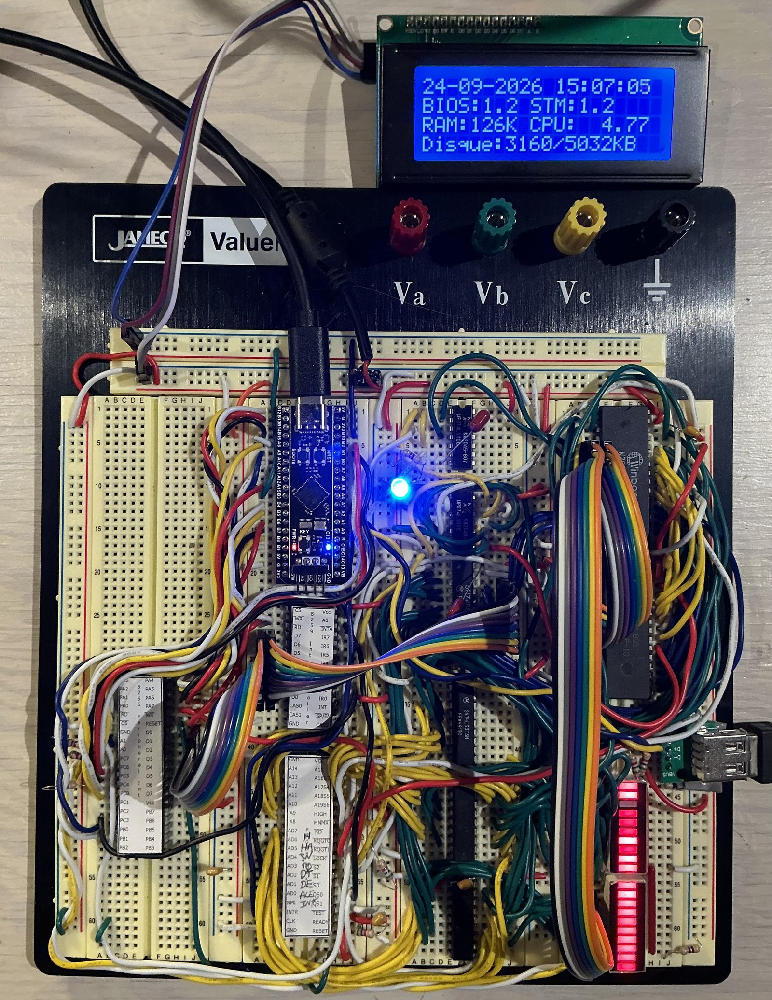
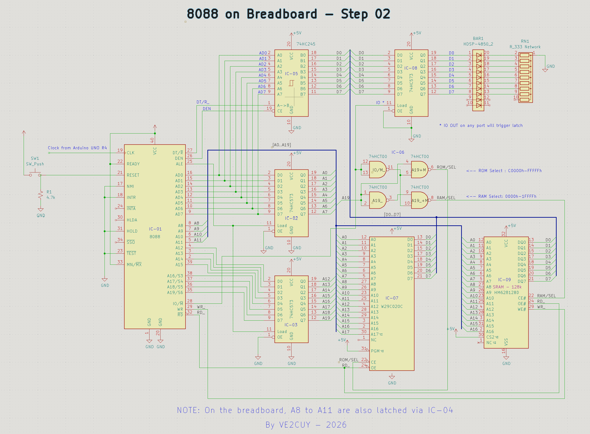
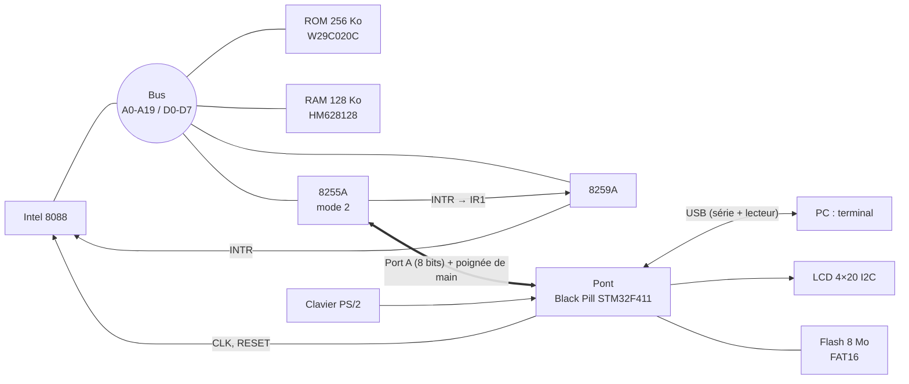
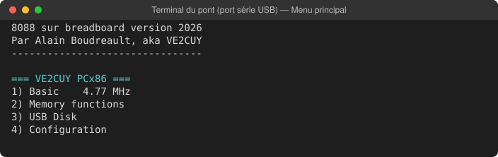
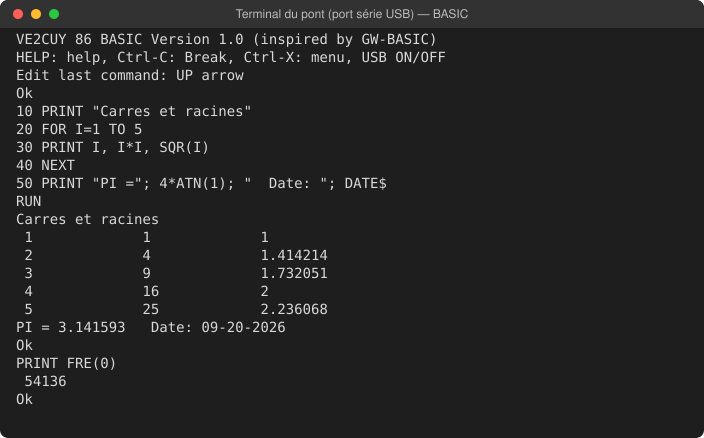
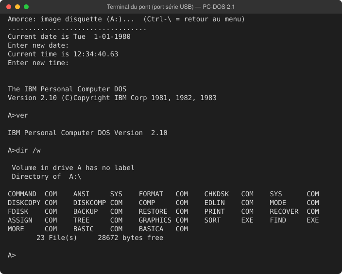
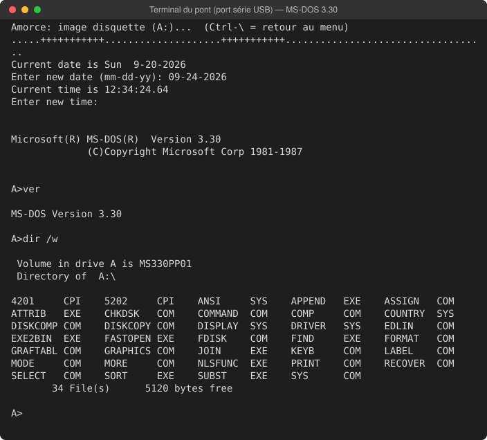

# breadboard-PC — un ordinateur 8088 sur plaquette d'essai

Un micro-ordinateur d'architecture inspirée du PC/XT, construit sur plaquette d'essai (*breadboard*)
autour d'un **Intel 8088**. Sa ROM, dont le code source est **entièrement écrit en assembleur** 8086,
démarre sur un menu interactif, exécute deux interpréteurs BASIC et **amorce PC-DOS 2.1 et MS-DOS 3.30**
depuis des images de disquette.

Projet d'Alain Boudreault (VE2CUY), 2026. *[English version](README_en.md)*

<p align="center">
  <br>
  <em>Le montage : le pont Black Pill STM32F411 (en haut, au centre), le 8088, le 8255, le 8259, la ROM et
  la RAM. Le LCD affiche l'écran « Information » (date et heure, versions, RAM, disque, vitesse).</em>
</p>

## En bref

| | |
|---|---|
| **Processeur** | Intel 8088, 4,77 MHz par défaut (réglable de 1 à 10 MHz) |
| **Mémoire** | ROM 256 Ko (W29C020C, `C0000h`–`FFFFFh`), RAM statique 128 Ko (HM628128, `00000h`–`1FFFFh`) |
| **Entrées/sorties** | 8255A en mode 2 (bus vers le pont), 8259A (interruptions), LCD 4×20 I2C, clavier PS/2 |
| **Pont** | Plaquette WeAct **Black Pill STM32F411** : clavier, terminal USB, LCD, horloge, disque, RESET |
| **Logiciel** | ROM entièrement en assembleur (NASM, jeu d'instructions 8086 strict), y compris les deux BASIC : menu, BIOS pour DOS, Tiny BASIC, BASIC de type GW-BASIC |
| **Systèmes** | PC-DOS 2.1 et MS-DOS 3.30 amorcés depuis une image de disquette |

## Le montage

Le cœur du montage (processeur, verrous d'adresses, ROM, RAM, décodage) est câblé sur plaquette
d'essai en logique 74HC/74HCT, sans logique programmable (ni GAL ni CPLD). Le décodage tient en quelques portes NAND :

- **ROM** : `A19 = 1` (fenêtre `C0000h`–`FFFFFh`) ;
- **RAM** : `A19 = 0` ;
- **8255** (ports `80h`–`83h`) : `A7` et cycle d'E/S ;
- **8259** (ports `20h`–`21h`) : `NAND(IO, A6, /A7)`.

<p align="center">
  <br>
  <em>Schéma du cœur (KiCad). L'horloge, fournie ici par un Arduino UNO R4, vient aujourd'hui du pont.</em>
</p>

## Le circuit électronique

Le 8088 ne pilote aucun périphérique en *bit-bang*. Tous les échanges passent par **un seul 8255 en
mode 2** : un bus de 8 bits bidirectionnel, avec poignée de main matérielle, relié au pont. Chaque octet
reçu du pont déclenche une interruption (`IR1` du 8259).



Le câblage détaillé du pont (broches, niveaux 3,3 V / 5 V, résistances de tirage) est décrit dans
[arduino/8088_bridge_stm32/README.md](arduino/8088_bridge_stm32/README.md).

## Le pont STM32

Le firmware du pont (projet PlatformIO, [arduino/8088_bridge_stm32](arduino/8088_bridge_stm32)) donne
au 8088 les périphériques d'un PC :

| Fonction | Détail |
|---|---|
| **Clavier PS/2** | Décodage des trames ; scan codes bruts transmis au 8088 |
| **Terminal** | Port série USB natif vers le PC (ANSI, 80 colonnes) |
| **Affichage** | LCD HD44780 4×20 sur I2C (PCF8574) |
| **Horloge temps réel** | RTC du STM32 (quartz 32,768 kHz) : `TIME$`, `DATE$`, `INT 1Ah` |
| **Disque** | Flash SPI W25Q64 de 8 Mo en FAT16 : fichiers, secteurs, images de disquette montées comme A: |
| **Lecteur USB** | La flash est offerte au PC comme clé USB (`USB ON` / `USB OFF`) pour y copier des fichiers |
| **Horloge du 8088** | Signal `CLK` généré par PWM matériel, de 1 à 10 MHz |
| **RESET du 8088** | Maintien au démarrage du pont ; **Ctrl-Alt-Suppr** (PS/2) ou **Ctrl-\\** (terminal) |

Le 8088 dialogue avec le pont par un protocole de commandes sur un canal dédié
(voir [Solution-01/lib/bridge.asm](Solution-01/lib/bridge.asm)).

## Le menu

Au démarrage, la ROM affiche un menu sur le terminal et sur le LCD. On le pilote indifféremment au
clavier PS/2 ou au terminal ; **Échap** revient au menu principal.

<p align="center">
  
</p>

| Menu | Options |
|---|---|
| **1) Basic** | Tiny BASIC ; BASIC de type GW-BASIC |
| **2) Memory functions** | Vidage et édition de la mémoire, registres du CPU, saisie et exécution de code, table des vecteurs, test de la RAM |
| **3) USB Disk** | Bascule du lecteur USB, liste des fichiers, **amorçage d'une image disque** |
| **4) Configuration** | Vitesse d'horloge, test de vitesse du CPU, réglage de la date et de l'heure, écran d'information |

## Le BASIC

Une réimplémentation originale inspirée de GW-BASIC : mêmes mots-clés, mêmes messages d'erreur,
entiers, flottants simple précision (logiciels) et chaînes. Environ 54 Ko sont libres pour les
programmes.

<p align="center">
  
</p>

| Catégorie | Commandes et fonctions |
|---|---|
| **Programme** | `RUN` `LIST` `EDIT` `DELETE` `NEW` `CLEAR` `CONT` `TRON` `TROFF` `HELP` `SYSTEM` |
| **Contrôle** | `IF…THEN…ELSE` `GOTO` `GOSUB`/`RETURN` `ON…GOTO/GOSUB` `FOR…NEXT` `WHILE…WEND` `END` `STOP` |
| **Données** | `LET` `DIM` `ERASE` `SWAP` `DATA`/`READ`/`RESTORE` `DEF FN` `DEFINT`/`DEFSNG`/`DEFSTR` |
| **Entrées/sorties** | `PRINT` `INPUT` `LINE INPUT` `INKEY$` `CLS` `LOCATE` `COLOR` `BEEP` |
| **Mathématiques** | `ABS` `SGN` `INT` `FIX` `SQR` `SIN` `COS` `TAN` `ATN` `LOG` `EXP` `RND` `RANDOMIZE` |
| **Chaînes** | `LEN` `LEFT$` `RIGHT$` `MID$` `INSTR` `CHR$` `ASC` `STR$` `VAL` `HEX$` `UCASE$` `STRING$` |
| **Fichiers** | `SAVE` `LOAD` `MERGE` `FILES` `KILL` `FORMAT` ; `OPEN` `PRINT #` `INPUT #` `EOF` `CLOSE` |
| **Horloge** | `TIMER` `TIME$` `DATE$` (lecture et réglage de la RTC du pont) |
| **Machine** | `PEEK` `POKE` `DEF SEG` `INP` `OUT` `WAIT` `CALL` `FRE` |
| **Disque et système** | `DSKREAD` `DSKWRITE` `USB ON`/`OFF` `BOOT "image.img"` |

## DOS 2.1 et DOS 3.3

La ROM fournit la couche BIOS qu'attend un DOS : disque (`INT 13h`, CHS et LBA), clavier (`INT 16h`),
horloge (`INT 1Ah`), affichage texte sur le terminal (`INT 10h`) et amorçage (`INT 19h`). Une image de
disquette copiée sur la flash (par le lecteur USB) est montée comme lecteur **A:** puis amorcée depuis
**USB Disk → 3) Boot disk image**, ou par `BOOT "PCDOS2_1.IMG"` au BASIC. Les écritures du DOS vont
dans le fichier image.

<p align="center">
  <br>
  <em>PC-DOS 2.1 : amorçage depuis l'image (un point par secteur lu), VER, DIR /W</em>
</p>

<p align="center">
  <br>
  <em>MS-DOS 3.30</em>
</p>

Limites : 128 Ko de RAM (DOS 5.0 et plus récent en exigent 256 Ko), pas d'écran vidéo matériel (les
programmes qui écrivent en mémoire vidéo ne s'affichent pas), clavier du DOS sur le terminal seulement.

## Construire la ROM

```sh
cd Solution-01
make            # solution-01.bin (256 Ko, à graver dans la W29C020C)
make check      # vérifie taille, vecteur de reset et signature
make test       # bancs d'essai sous émulateur (Unicorn)
make test-rom   # la ROM complète simulée : DOS, BASIC, clavier PS/2
```

Outils : NASM, GNU Make, Python 3 (+ `unicorn` pour les tests) ; PlatformIO pour le pont
(`platformio run -e blackpill_f411ce_usbdrive -t upload`, carte en mode DFU).

## Organisation du dépôt

| Dossier | Contenu |
|---|---|
| [Solution-01/](Solution-01) | ROM du 8088 (NASM) et tests ; documentation technique complète dans [Solution-01/README.md](Solution-01/README.md) |
| [arduino/8088_bridge_stm32/](arduino/8088_bridge_stm32) | Firmware du pont Black Pill STM32F411 (PlatformIO) |
| [kicad/](kicad) | Schémas du montage |
| [PC-DOS/](PC-DOS) | Images de disquette de test |
| [medias/](medias) | Fiches techniques, schémas et captures |

> Les captures du terminal de cette page sont produites par la ROM réelle, exécutée dans le
> simulateur du projet ([medias/captures/generer.py](medias/captures/generer.py)).
